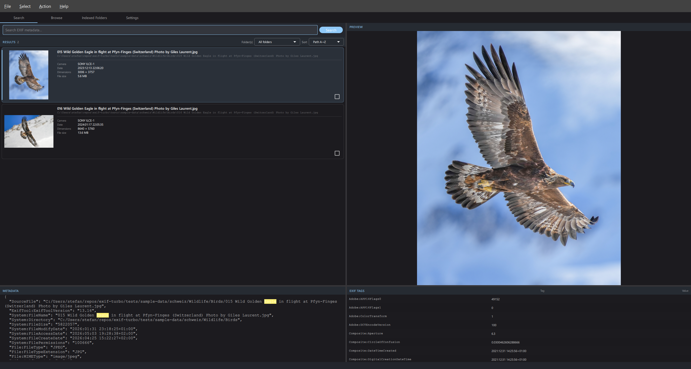

# exif-turbo

Fast image EXIF metadata search and indexing tool with a PySide6 QML desktop UI.
Fully generated using VS Code Copilot.



*Photo: © [Giles Laurent](https://gileslaurent.com), [CC BY-SA 4.0](https://creativecommons.org/licenses/by-sa/4.0/)*

📖 **[User Manual](docs/user-manual.md)** ([PDF](docs/user-manual.pdf)) — full feature reference, keyboard shortcuts, and screenshots.

## Features

- **Video indexing** — MP4, MOV, AVI, MKV, WMV, M4V, MTS, M2TS, 3GP, WebM, FLV are indexed alongside still images; thumbnails and previews are decoded via PyAV/FFmpeg using the embedded thumbnail when present, otherwise a representative frame at 1/3 of the video duration. Rotation is applied from the QuickTime `tkhd` display matrix so portrait iPhone clips render upright.
- **Recreate Thumbnail / Recreate Preview** — right-click the preview image to rebuild a single thumbnail or preview if it ever looks wrong (e.g. video frame extracted before the rotation fix); the left-grid thumbnail refreshes immediately via a cache-busting URL.
- **Self-healing cache** — after every folder index run a fast garbage-collection pass deletes orphaned thumbnail and preview files (those whose source image no longer exists in the database). Status bar reports *“Cleaning up cache…”* during the sweep.
- **Encrypted thumbnail and preview cache** — thumbnails and rendered previews are stored AES-256-GCM encrypted on disk; the encryption key is derived from the user’s password using a wrapped-key model so changing the password does not require rebuilding the cache
- **Change Password** — re-encrypts the SQLCipher database under a new passphrase without rebuilding thumbnails; existing encrypted thumbnails remain valid
- **Copy to Clipboard** — right-click the preview image or click the **Copy** pill button to copy the rendered preview to the system clipboard; a toast notification confirms the copy; falls back to copying the file path as text if rendering fails
- **Build Previews** — per-folder action builds a cache of downscaled preview JPEGs for instant display; configurable long-edge resolution in Settings
- **`×` clear button** — when the search field contains text a `×` button clears it immediately (equivalent to pressing **Enter** with an empty bar)
- **ExifTool not-found dialog** — if ExifTool is absent at unlock time a modal dialog explains that indexing is disabled and links to exiftool.org; search and browse of existing data continue normally
- Full-text search over all EXIF metadata using SQLite FTS5
- **Search-syntax tooltip** — a `?` button next to the search field shows an inline cheat-sheet (single token, phrases, AND/OR/NOT, prefix wildcard) translated into all supported languages
- **GPS location bar** — when the selected image has GPS coordinates, a bar in the Metadata panel shows one-click links to OpenStreetMap, Google Maps, and GeoHack (Wikimedia coordinate hub)
- PySide6 QML UI with Material Design — light, dark, or system theme
- Multilanguage UI: English, German, French, Italian, Romansh
- Search and Browse tabs with 50/50 split-pane thumbnail preview
- Folder management — add, remove, enable/disable indexed folders with per-folder status
- Multi-folder filter — when multiple folders are indexed, a **Folder(s)** dropdown in the search RESULTS header filters results to one or more selected folders simultaneously
- Scoped rescan — rescanning a single folder only updates that folder's records; other indexed folders are never touched
- Reset Database — wipes all indexed images, folder records, and thumbnail cache in one step; database file shrinks immediately
- RAW format support: CR2, CR3, NEF, ARW, DNG, ORF, RW2, PEF, RAF, RWL, SRW
- EXIF orientation correction for thumbnails (all formats including RAW)
- Encrypted database at rest (SQLCipher); passphrase set on first launch, unlocked via the UI
- **Mark / select images** — select all results (or deselect all) with a single menu action; individual checkbox per result row
- **Select images without thumbnail** — `Select → Select Images Without Thumbnail` marks every result whose thumbnail is not yet cached on disk (including images the thumbnailer permanently gave up on), so they can be exported, deleted or rescanned in bulk
- **Export marked images as JSON** — exports EXIF metadata for all marked images to a JSON file, respecting the current UI sort order
- **Delete marked images** — `Action → Delete Marked Images…` permanently removes every marked image from disk *and* from the index, including any cached thumbnail and rendered preview; a confirmation dialog requires you to type the exact count to proceed
- **Bulk-op progress overlay** — modal overlay with a progress bar and live `X / Y` count during select-all, deselect-all, and export operations; cancelable at any time
- **Unlock spinner** — animated indicator shown on the lock screen while the encrypted database is being opened
- **Capture-date indexing & timeline filter** — `DateTimeOriginal` / `CreateDate` EXIF tags are stored as a UTC epoch timestamp (`captured_at`). After indexing, a **year histogram** appears in the Search tab: click a bar to filter to that year, shift-click a second bar to extend the range, click the active bar again to clear, or hit the `×` chip. Images without an EXIF date fall back to the file-system creation time (macOS/Windows) or mtime (Linux).
- **Fast NAS scanning** — on macOS/Linux, `ImageFinder` spawns up to 8 parallel `find` subprocesses (one per top-level subdirectory) so all `getdents()`/`lstat()` calls happen inside a C binary outside the Python GIL; a live "N files found…" counter updates the progress panel while discovery is still running

## Recent changes

### Capture-date indexing and timeline filter

Every image now stores a `captured_at` UTC timestamp in the database, resolved
in priority order:

1. EXIF `DateTimeOriginal` / `CreateDate` (group-prefixed `ExifIFD:` or `IFD0:`)
   — sub-second suffixes are stripped before parsing.
2. File-system creation time (`st_birthtime` on macOS, `st_ctime` on Windows).
3. Modification time (mtime) as a last resort on Linux.

After re-indexing, a **year histogram** bar chart appears below the format
chips in the Search tab whenever at least one image has a known capture date:

- **Click** a bar to filter results to that year.
- **Shift-click** a different bar to extend the range (tooltip hints this when
  a filter is already active).
- **Click the active bar** again to clear the filter.
- **`×` chip** at the right also clears the filter.

Images that have no capture date are excluded from results when a date filter
is active. The histogram reflects the current search query and folder/format
filters.

New sort options **Date taken ↓** / **Date taken ↑** sort purely by `captured_at`;
images without an EXIF date sort last in both directions. **Newest/Oldest first**
continues to sort by filesystem `mtime`. The chosen sort order is persisted per
database in `settings.json` and restored on the next launch.

### Bundle ExifTool in Windows MSI

ExifTool (by Phil Harvey, GPL/Artistic licence) is now **bundled inside the Windows MSI installer**
as an optional but pre-selected feature. During installation the WiX feature-tree UI lets you
deselect it if you already have ExifTool installed system-wide.

The bundled copy is placed at `C:\Program Files\exif-turbo\exiftool\exiftool.exe`.
exif-turbo checks `PATH` first and falls back to the bundled copy only when no system-wide
`exiftool` is found. macOS and Linux are unchanged — ExifTool must still be installed manually.

The MSI is built with `scripts/build_windows.py`, which downloads ExifTool from exiftool.org
at build time (internet required during the build, not at runtime).

### Video indexing

Video files (MP4, MOV, AVI, MKV, WMV, M4V, MTS, M2TS, 3GP, WebM, FLV) are now
indexed alongside still images. EXIF/QuickTime metadata is extracted via
ExifTool exactly as for photos. Thumbnails and previews are produced via
**PyAV** (FFmpeg bindings):

1. The embedded cover/thumbnail stream is used when present (instant decode).
2. Otherwise PyAV seeks to **1/3 of the video duration** and decodes the
   keyframe nearest that point.
3. Rotation is read first from the `rotate` tag, then — if absent — from the
   QuickTime `tkhd` atom display matrix. iOS portrait clips that PyAV does
   not surface `stream.side_data` for are rotated correctly via direct atom
   parsing.

The `ThumbWorker` skips the file-size guard for video files so a 4 GB MP4
still produces a thumbnail (only one frame is decoded, not the whole file).

### Recreate Thumbnail / Recreate Preview

Right-clicking the preview image now exposes two extra context-menu items in
addition to *Copy Image to Clipboard*:

- **Recreate Thumbnail** — deletes the cached `.png`/`.enc`/`.skip` for the
  selected image and re-queues the thumb worker. The left-grid thumbnail
  refreshes immediately because the model now serves all thumbs through
  `image://thumb/<sha1>?t=N` and bumps the bust counter on rebuild, defeating
  the QML pixmap cache without requiring a full reload.
- **Recreate Preview** — deletes the cached preview JPEG/`jpg.enc` and bumps
  the preview URL bust counter so the provider re-renders on next paint.

### Self-healing cache GC

At the end of every successful folder index run, `IndexWorker` performs a
garbage-collection pass against the cache directories:

- Computes `SHA1(path|mtime|size)` for every row currently in the DB.
- Scans `<db>/thumbs/` and `<db>/thumbs/previews/` and unlinks every file
  whose 40-character SHA-1 prefix is not in the expected set.
- Status bar shows *“Cleaning up cache…”* (translated) while the sweep runs.

This self-heals across crashes, file moves, external deletions, and the old
bug where `delete_missing` left orphaned encrypted previews behind.

### Linux DEB/RPM packaging

`scripts/build_linux.py` produces both a `.deb` and a `.rpm` from the
PyInstaller onedir bundle using **fpm**. The package installs to
`/opt/exif-turbo/`, registers a `.desktop` launcher with the bundled
`assets/icon.png`, and creates a `/usr/bin/exif-turbo` symlink.

### Copy preview image to clipboard

A **Copy** pill button appears in the preview header of both the Search and Browse
tabs. Right-clicking the preview area opens a context menu with the same action.
Invoking either calls `controller.copyPreviewToClipboard()`, which renders the
current preview via `render_preview()`, converts it to a `QImage`, and places it
on the system clipboard via `QGuiApplication.clipboard().setImage()`. A toast
overlay at the bottom of the window confirms success. If rendering fails the
file path is copied as plain text instead.

### Encrypted thumbnail and preview cache

Thumbnails and rendered preview JPEGs are now stored AES-256-GCM encrypted
on disk. The encryption uses a random per-cache master key that is itself
stored password-wrapped in a `.thumb_key` file (v2 layout). Changing the
database password re-wraps only the master key — no thumbnails or previews
need to be rebuilt.

`ThumbnailImageProvider` serves `image://thumb/<sha1_hex>` URIs, decrypting
on demand in Qt’s async image-provider pool.

### Change Password

A **Change Password…** button in the Settings tab re-encrypts the SQLCipher
database off the GUI thread (`PasswordChangeWorker`). The dialog requires the
current password plus a new passphrase + confirmation. On success the
`ThumbCrypto` master key is re-wrapped under the new password so all cached
thumbnails remain valid immediately.

### Preview cache builder

A **Build Previews** action on each folder row in the Indexed Folders tab
launches `PreviewBuildWorker`, which renders downscaled JPEG previews for all
images in that folder and stores them in the preview cache (encrypted when a
database key is set). The preview long-edge resolution is configurable in
Settings (**Preview Cache Size**). The Search tab shows a **Show Preview /
Show Original** toggle to switch between the cached preview and the full
resolution source. While a full-resolution original loads, a
**"Loading original…"** overlay with a spinner appears over the preview area.

### ExifTool not-found dialog and settings badge

If ExifTool is absent when the database is unlocked, a modal dialog pops up
automatically explaining that indexing is disabled and providing a link to
exiftool.org. The Settings tab **ExifTool** section shows a colour-coded
badge (green = found with version, red = not found); a **Check** button
re-probes on demand.

### `×` clear button in search field

When the search field contains text a `×` button appears to its left.
Clicking it clears the field and immediately shows all images.

### macOS worker-count lock

On macOS the indexing worker count is automatically locked to **1** to prevent
Python GIL starvation that can occur with network-share folders. The spinner in
Settings is disabled in this configuration.

### Fast NAS scanning (macOS/Linux)

On macOS and Linux, `ImageFinder` spawns up to 8 parallel `find` subprocesses
— one per top-level subdirectory — via a `ThreadPoolExecutor` backed by a
shared `queue.Queue`. All `getdents()`/`lstat()` calls happen inside a C binary,
completely outside the Python GIL. This prevents the event-loop freezes
previously caused by macOS SMB mounts (where every `scandir()` entry has
`DT_UNKNOWN`, forcing a per-file `lstat()` through the GIL). Results stream
back live, so the **"N files found…"** count label updates while discovery is
still running.

On Windows, `os.walk()` is used instead — SMB returns file attributes inline so
no extra `stat()` calls are needed.

## Test suite

178 automated tests across four layers:

| Suite | Count | What it covers |
|-------|-------|----------------|
| `tests/data/` | 64 | Repository: upsert, FTS5 search, delete_missing (scoped), clear_all, excluded paths, folder management, rekey, `captured_at` persistence, date-range filter, `get_year_counts` |
| `tests/indexing/` | 31 | Image utils, metadata text, IndexerService e2e (real JPEG/PNG files), scoped rescan, `_resolve_captured_at` (EXIF parse, sub-second suffix, fallback chain) |
| `tests/ui/` | 64 | Live QML window driven via pytest-qt — unlock, search, filter, folder add/remove/enable, controller state, ext filter, zoom, thumbnail loading, preview build worker, raw preview toggle, metadata panel scroll, sort combo |
| `tests/utils/` | 19 | Preview cache naming/clearing, thumb crypto (encrypt/decrypt, password change, legacy migration) |

**Total: 178**

## Requirements

### ExifTool

This application requires **ExifTool** to be installed and on `PATH`.
ExifTool reads EXIF, IPTC, XMP, and other metadata from image files.

Download: https://exiftool.org/

**Windows (MSI install):** ExifTool is **bundled inside the MSI** — no separate download needed.
A system-wide `exiftool.exe` on your `PATH` takes priority if you have one installed.

**Windows (source install):** download the standalone `.exe`, rename to `exiftool.exe`, place on `PATH`.

**macOS:**
```bash
brew install exiftool
```

If Homebrew is not installed yet:
```bash
/bin/bash -c "$(curl -fsSL https://raw.githubusercontent.com/Homebrew/install/HEAD/install.sh)"
```

**Linux (Debian/Ubuntu):**
```bash
sudo apt install exiftool
```

## Installation

### Windows / macOS installer (recommended)

Download the latest installer from the [Releases page](https://github.com/baddonkey/exif-turbo/releases):

- **Windows**: `exif-turbo-<version>-windows.msi` — installs to `%ProgramFiles%\exif-turbo\`, adds Start Menu shortcut; **ExifTool is bundled inside the MSI** so no separate download is needed
- **macOS**: `exif-turbo-<version>-macos.dmg` — drag-and-drop installer; signed app bundle
- **Linux**: `exif-turbo_<version>_amd64.deb` (Debian/Ubuntu) and `exif-turbo-<version>-1.x86_64.rpm` (Fedora/openSUSE) — installs to `/opt/exif-turbo/` with a `.desktop` entry and `/usr/bin/exif-turbo` symlink

### From source

```bash
pip install -e .
```

## Usage

### Launch the GUI

```bash
exif-turbo
```

Use `--db <name>` to open a named database (stored under
`~/.exif-turbo/data/<name>.db`):

```bash
exif-turbo --db holidays
```

Print the installed version and exit:

```bash
exif-turbo --version
```

Folders to index are managed inside the GUI on the **Indexed Folders** tab.

### Python module invocation

```bash
python -m exif_turbo.app
python -m exif_turbo.app --db holidays
```

## Configuration

Control whether dotfiles (filenames starting with `.`) are indexed:

| Method | Value |
|--------|-------|
| Environment variable | `EXIF_TURBO_SKIP_DOTFILES=true\|false` (default: `true`) |

## FTS5 Query Syntax

```
term                    # single keyword
"exact phrase"          # phrase search
term1 AND term2
term1 OR term2
term1 NOT term2
prefix*                 # prefix wildcard
```

ExifTool group-prefixed keys (e.g. `GPS:GPSLatitude`, `ExifIFD:FocalLength`)
can be typed verbatim — the colon is treated as a word separator.

Examples:

```
Canon 50mm
"red car" AND mexico
GPS:GPSLatitude
ExifIFD:FocalLength
```

## License

MIT — see [LICENSE](LICENSE).

Third-party software credits: [THIRD-PARTY-LICENSES.md](THIRD-PARTY-LICENSES.md).

## Building from source

### Windows MSI

Requirements: `pip install pyinstaller babel pillow`, [WiX Toolset v4](https://wixtoolset.org/)

```powershell
python scripts\build_windows.py
# Produces: dist\exif-turbo\  and  dist\exif-turbo-<version>-windows.msi
```

### macOS DMG

Requirements: `pip install pyinstaller babel pillow`, Xcode Command Line Tools

```bash
python scripts/build_macos.py
# Produces: dist/exif-turbo.app  and  dist/exif-turbo-<version>-macos.dmg
```

### Tagging a release

Use the `/release` prompt in VS Code Copilot Chat.

## Sample Image Credits

The sample images used in tests and screenshots are photographs by
**[Giles Laurent](https://commons.wikimedia.org/wiki/User:Giles_Laurent)**,
published on Wikimedia Commons under the
[Creative Commons Attribution-ShareAlike 4.0 International (CC BY-SA 4.0)](https://creativecommons.org/licenses/by-sa/4.0/) license.

Mandatory attribution: © Giles Laurent, gileslaurent.com, License CC BY-SA

See [tests/sample-data/ATTRIBUTION.md](tests/sample-data/ATTRIBUTION.md) for the full list of images and their Wikimedia Commons links.
