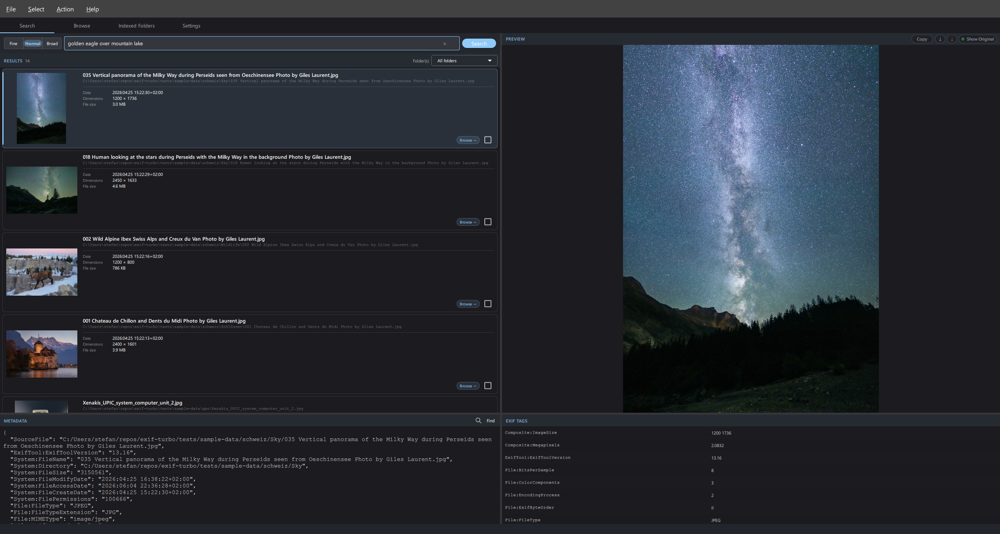
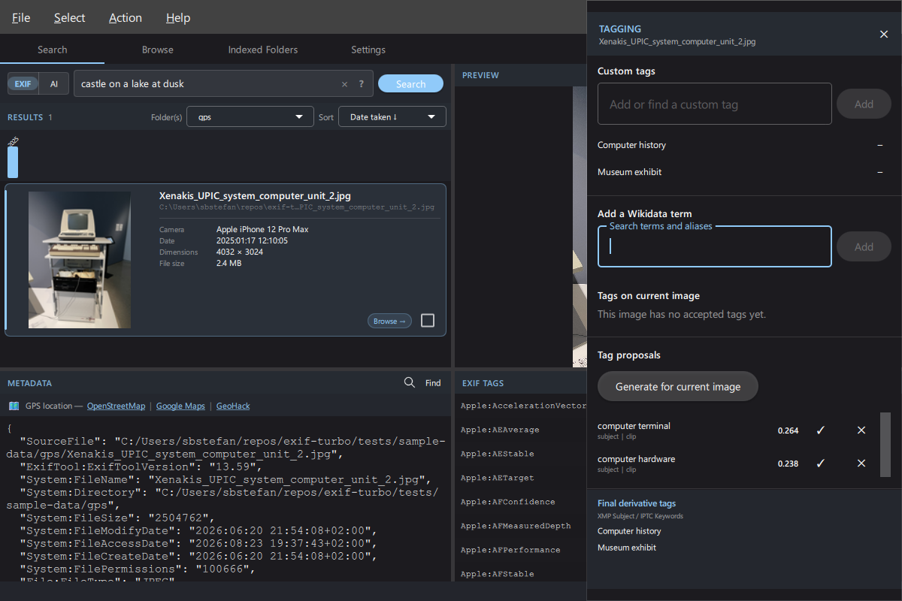

# exif-turbo

Fast image EXIF metadata search and indexing tool with a PySide6 QML desktop UI.
Fully generated using VS Code Copilot.


*Photo: [Wild Golden Eagle](https://commons.wikimedia.org/wiki/File:015_Wild_Golden_Eagle_in_flight_at_Pfyn-Finges_(Switzerland)_Photo_by_Giles_Laurent.jpg), © [Giles Laurent](https://gileslaurent.com), License [CC BY-SA 4.0](https://creativecommons.org/licenses/by-sa/4.0/). Scaled/cropped in the UI; screenshot composite licensed CC BY-SA 4.0.*



*Photo: [Chateau de Chillon and Dents du Midi](https://commons.wikimedia.org/wiki/File:001_Chateau_de_Chillon_and_Dents_du_Midi_Photo_by_Giles_Laurent.jpg), © [Giles Laurent](https://gileslaurent.com), License [CC BY-SA 4.0](https://creativecommons.org/licenses/by-sa/4.0/). Scaled/cropped in the UI; screenshot composite licensed CC BY-SA 4.0.*



*Photo: [Xenakis UPIC system computer unit](https://commons.wikimedia.org/wiki/File:Xenakis_UPIC_system_computer_unit_2.jpg) by 1904.CC (Manuel Schmalstieg), [CC0 1.0](https://creativecommons.org/publicdomain/zero/1.0/), via Wikimedia Commons. Scaled/cropped in the UI; attribution is voluntary.*

📖 **[User Manual](docs/user-manual.md)** ([PDF](docs/user-manual.pdf)) — full feature reference, keyboard shortcuts, and screenshots.

## Features

- **Video indexing** — MP4, MOV, AVI, MKV, WMV, M4V, MTS, M2TS, 3GP, WebM, FLV are indexed alongside still images; thumbnails and previews are decoded via PyAV/FFmpeg (embedded thumbnail when present, otherwise a frame at 1/3 of duration); rotation from the `tkhd` display matrix keeps portrait clips upright.
- **AI semantic search (CLIP)** — switch the Search bar from **EXIF** to **AI** mode to search by natural-language intent (for example, "golden eagle over mountain lake") instead of exact metadata tokens. A precision picker controls match strictness: **Fine** (>= 0.22), **Normal** (>= 0.20), **Broad** (>= 0.18).
- **AI-Scan and AI Full Rescan (per folder)** — in **Indexed Folders**, build missing CLIP embeddings for one folder with **AI-Scan**, or rebuild all vectors for that folder with **AI Full Rescan**. Image-vector schema v2 stores the full image plus four corner-crop embeddings; existing indexes require **AI Full Rescan** to upgrade. Vector data is persisted per database (`ai_index.faiss` + `ai_id_map.json`) for fast repeat AI searches.
- **Non-destructive tagging** — enable tagging per database and open the right-side workbench from Search or Browse with the tag button or **Ctrl+T**. The app ships an offline, curated 8,313-concept visual vocabulary from Wikidata under CC0, with mandatory English, German, French, and Italian labels and aliases. Its reviewed 8,200-concept base is extended with qualified concepts linked to the Library of Congress TGM. Accepted QIDs use sidecar schema v2; custom tags and legacy `loc-tgm` entries remain readable. Originals are never changed, and accepted tags participate in FTS5 search in all four metadata languages.
- **Current-image tag review** — inspect keywords already embedded in the original and exclude individual keywords, or ignore all embedded keywords, when producing derivatives. Exclusion choices persist in the adjacent sidecar without changing the original. Create custom tags or reuse remembered labels, search Wikidata preferred labels and aliases, and review CLIP proposals generated automatically when the drawer opens or the focused image changes. A fixed footer previews the exact merged, deduplicated keyword set for a derivative. Undecided suggestions are ephemeral; accepted tags and rejected decisions persist.
- **Copy Tags** — copy the focused image's accepted controlled/custom tags and embedded-tag ignore settings to marked images, every current search result (including unloaded pages), or the current Browse folder. Individual exclusions transfer only when the target contains the same embedded tag. **Add** merges tags and applicable ignore settings; **Replace** confirms before substituting them. The source image is always excluded.
- **Refresh sidecar tags per folder** — **Refresh Tags** on an Indexed Folders row force-rereads sidecars for that folder's indexed images without re-extracting EXIF or rebuilding previews. Added, changed, and deleted sidecars update the tag/search cache; malformed sidecars are left untouched and reported.
- **Wikidata proposal controls** — the controlled vocabulary is bundled and needs no install, update, localization pack, or network access. Build its separate term-vector index under **Settings → Tagging and Controlled Vocabulary**. Each QID has independent English, German, French, and Italian prompt vectors; proposal ranking selects the highest cosine similarity across all prompt locales and image views. Proposal and auto-accept defaults are **0.20** and **0.28**; auto-accept is disabled by default.
- **Tagged derivatives** — copy either every current search result (including unloaded pages) or all marked images to a user-selected folder outside indexed roots while preserving source formats and relative folder trees. Non-excluded embedded keywords are merged with accepted controlled/custom labels, deduplicated case-insensitively, and verified in XMP Subject and IPTC Keywords on each copy. Existing destinations and images without accepted additions are skipped; originals and adjacent sidecars are not copied or modified.
- **macOS Intel limitation** — AI features are automatically disabled on macOS Intel (x86_64) targets. The Settings switch is greyed out because PyTorch is not supported there for Python 3.13+.
- **Recreate Thumbnail / Recreate Preview** — right-click the preview image to rebuild a single thumbnail or preview if it ever looks wrong (e.g. video frame extracted before the rotation fix); the left-grid thumbnail refreshes immediately via a cache-busting URL.
- **Self-healing cache** — after every folder index run a fast garbage-collection pass deletes orphaned thumbnail and preview files (those whose source image no longer exists in the database). Status bar reports *“Cleaning up cache…”* during the sweep.
- **Encrypted thumbnail and preview cache** — thumbnails and rendered previews are stored AES-256-GCM encrypted on disk; the encryption key is derived from the user’s password using a wrapped-key model so changing the password does not require rebuilding the cache
- **Change Password** — re-encrypts the SQLCipher database under a new passphrase without rebuilding thumbnails; existing encrypted thumbnails remain valid
- **Preview panel toolbar** — identical pill buttons on **both the Search and Browse tab** preview panes, plus a right-click context menu: **Copy** copies the rendered preview to the system clipboard (falls back to the file path as text); **Save Preview As** (white ⤓) saves the displayed preview as JPEG or PNG with a suggested filename; **Save Original As** (orange ⤓) copies the source file byte-for-byte; **Show Original / Show Preview** toggle switches between the cached preview and the full-resolution source; a loading overlay with a spinner appears while a full-resolution original is decoding; a toast confirms each save/copy action
- **Build Previews** — per-folder action builds a cache of downscaled preview JPEGs for instant display; configurable long-edge resolution in Settings
- **`×` clear button** — when the search field contains text a `×` button clears it immediately (equivalent to pressing **Enter** with an empty bar)
- **ExifTool not-found dialog** — if ExifTool is absent at unlock time a modal dialog explains that indexing is disabled and links to exiftool.org; search and browse of existing data continue normally
- Full-text search over all EXIF metadata using SQLite FTS5
- **Search-syntax tooltip** — a `?` button next to the search field shows an inline cheat-sheet (single token, phrases, AND/OR/NOT, prefix wildcard) translated into all supported languages
- **GPS location bar** — when the selected image has GPS coordinates, a bar in the Metadata panel shows one-click links to OpenStreetMap, Google Maps, and GeoHack (Wikimedia coordinate hub)
- PySide6 QML UI with Material Design — light, dark, or system theme
- Multilanguage UI: English, German, French, Italian, Romansh
- Search and Browse tabs with 50/50 split-pane thumbnail preview
- **"Browse →" button** — each search result card has a `Browse →` pill in the bottom-right corner; clicking it switches directly to the Browse tab and scrolls to that exact image in its folder, preserving the Search-tab state (query, filters, scroll position) for seamless return
- **"← Search" back button** — a `← Search` pill in the Browse-tab image list header switches back to the Search tab and restores the exact scroll position and selected image from before the Browse jump
- **Browse tab Metadata and EXIF Tags panels** — the Browse tab now shows the same **METADATA** and **EXIF TAGS** panels (and GPS location bar) as the Search tab; a split view below the image list and preview panel shows the metadata JSON panel (with an inline Ctrl+F find bar) and the EXIF tags table side-by-side
- **Busy cursor and UI overlay during search** — while a search is running, the cursor switches to a busy cursor and a semi-transparent grey overlay dims the entire UI, blocking input until results are ready
- Folder management — add, remove, enable/disable indexed folders with per-folder status; removing a folder runs on a background worker behind a modal progress overlay that shows each sub-step (clearing cached previews, deleting index entries) and can be canceled while previews are still being cleared
- Multi-folder filter — when multiple folders are indexed, a **Folder(s)** dropdown in the search RESULTS header filters results to one or more selected folders simultaneously; drive roots (e.g. `C:\`) appear with a friendly label such as `OS (C:)` instead of an empty name
- Scoped rescan — rescanning a single folder only updates that folder's records; other indexed folders are never touched
- Reset Database — wipes all indexed images, folder records, and thumbnail cache in one step; database file shrinks immediately. A modal progress overlay reports each sub-step (clearing the preview cache, deleting index rows, vacuuming the database); the preview-cache phase can be canceled, while the irreversible database vacuum runs to completion
- RAW format support: CR2, CR3, NEF, ARW, DNG, ORF, RW2, PEF, RAF, RWL, SRW
- **Large image rendering via libvips** — images exceeding 100 MP (panoramas, medium-format scans, large TIFFs) are decoded via **libvips** (`pyvips`) instead of Pillow, streaming only the tiles needed so memory use stays constant; bundled in the Windows MSI, Linux DEB, and Linux RPM packages.
- EXIF orientation correction for thumbnails (all formats including RAW)
- Encrypted database at rest (SQLCipher); passphrase set on first launch, unlocked via the UI
- **Mark / select images** — select all results (or deselect all) with a single menu action; individual checkbox per result row
- **Select images without thumbnail** — `Select → Select Images Without Thumbnail` marks every result whose thumbnail is not yet cached on disk (including images the thumbnailer permanently gave up on), so they can be exported, deleted or rescanned in bulk
- **Export marked images as JSON** — exports EXIF metadata for all marked images to a JSON file, respecting the current UI sort order; the output format is configurable in **Settings → JSON Export Formatting** (compact one-record-per-line by default, or pretty-printed with tabs or a chosen number of spaces)
- **Delete marked images** — `Action → Delete Marked Images…` permanently removes every marked image from disk *and* from the index, including any cached thumbnail and rendered preview; a confirmation dialog requires you to type the exact count to proceed
- **Bulk-op progress overlay** — modal overlay with a progress bar and live `X / Y` count during select-all, deselect-all, and export operations; cancelable at any time. The same overlay also covers the long-running **Remove Folder** and **Reset Database** maintenance actions, showing a per-step detail message and disabling its Cancel button (with a "this step cannot be canceled" notice) during phases that must not be interrupted, such as the database vacuum
- **Unlock spinner** — animated indicator shown on the lock screen while the encrypted database is being opened
- **Capture-date indexing & timeline filter** — the capture date is resolved from a prioritised chain of metadata fields and stored as a UTC epoch timestamp (`captured_at`); a **year histogram** in the Search tab lets you click or shift-click bars to filter by year range; see *Capture-date resolution* below for the full fallback chain.


## Test suite

522 automated tests across six areas:

| Suite | Count | What it covers |
|-------|-------|----------------|
| `tests/data/` | 124 | SQLCipher repositories, indexing/search state, marks, sidecar/tag caches, TGM snapshots, AI vectors, exclusions, and rekeying |
| `tests/indexing/` | 54 | Image/video utilities, metadata extraction and text, AI indexing, scoped rescans, and capture-date resolution |
| `tests/tagging/` | 69 | Sidecars, synchronization, TGM import/update/search, proposal ranking, custom tags, derivative planning, and verified ExifTool writes |
| `tests/ui/` | 230 | Controller/workers/models plus live QML coverage for search, browse, settings, tagging, exports, previews, folders, and bulk operations |
| `tests/utils/` | 43 | Preview/thumbnail cache, encryption, path labels, process helpers, rendering, and video frames |
| `tests/test_app.py` | 2 | Application entry-point argument handling |

**Total: 522**

## Requirements

### ExifTool

This application requires **ExifTool** to be installed and on `PATH`.
ExifTool reads EXIF, IPTC, XMP, and other metadata from image files.

Download: https://exiftool.org/

**Windows (MSI install):** ExifTool is **bundled inside the MSI** — no separate download needed.
A system-wide `exiftool.exe` on your `PATH` takes priority if you have one installed.

**Windows (source install):** download the standalone `.exe`, rename to `exiftool.exe`, place on `PATH`.

**macOS:**
```bash
brew install exiftool
```

If Homebrew is not installed yet:
```bash
/bin/bash -c "$(curl -fsSL https://raw.githubusercontent.com/Homebrew/install/HEAD/install.sh)"
```

**Linux (Debian/Ubuntu):**
```bash
sudo apt install exiftool
```

## Installation

### Windows / macOS installer (recommended)

Download the latest installer from the [Releases page](https://github.com/baddonkey/exif-turbo/releases):

- **Windows**: `exif-turbo-<version>-windows.msi` — installs to `%ProgramFiles%\exif-turbo\`, adds Start Menu shortcut; **ExifTool is bundled inside the MSI** so no separate download is needed
- **macOS**: `exif-turbo-<version>-macos.dmg` — drag-and-drop installer; signed app bundle
- **Linux**: `exif-turbo_<version>_amd64.deb` (Debian/Ubuntu) and `exif-turbo-<version>-1.x86_64.rpm` (Fedora/openSUSE) — installs to `/opt/exif-turbo/` with a `.desktop` entry and `/usr/bin/exif-turbo` symlink

### From source

```bash
pip install -e .
```

## Usage

### Launch the GUI

```bash
exif-turbo
```

Use `--db <name>` to open a named database (stored under
`~/.exif-turbo/data/<name>.db`):

```bash
exif-turbo --db holidays
```

Print the installed version and exit:

```bash
exif-turbo --version
```

Folders to index are managed inside the GUI on the **Indexed Folders** tab.

### Python module invocation

```bash
python -m exif_turbo.app
python -m exif_turbo.app --db holidays
```

## Configuration

Control whether dotfiles (filenames starting with `.`) are indexed:

| Method | Value |
|--------|-------|
| Environment variable | `EXIF_TURBO_SKIP_DOTFILES=true\|false` (default: `true`) |

## FTS5 Query Syntax

```
term                    # single keyword
"exact phrase"          # phrase search
term1 AND term2
term1 OR term2
term1 NOT term2
prefix*                 # prefix wildcard
```

ExifTool group-prefixed keys (e.g. `GPS:GPSLatitude`, `ExifIFD:FocalLength`)
can be typed verbatim — the colon is treated as a word separator.

Examples:

```
Canon 50mm
"red car" AND mexico
GPS:GPSLatitude
ExifIFD:FocalLength
```

## License

MIT — see [LICENSE](LICENSE).

Third-party software credits: [THIRD-PARTY-LICENSES.md](THIRD-PARTY-LICENSES.md).

The MIT license does not replace third-party image terms. Screenshot composites
containing Giles Laurent photographs are distributed under CC BY-SA 4.0; see
[docs/screenshots/README.md](docs/screenshots/README.md) and the canonical
[sample-data attribution manifest](tests/sample-data/ATTRIBUTION.md).

## Building from source

### Windows MSI

Requirements: `pip install pyinstaller babel pillow`, [WiX Toolset v4](https://wixtoolset.org/)

```powershell
python scripts\build_windows.py
# Produces: dist\exif-turbo\  and  dist\exif-turbo-<version>-windows.msi
```

### macOS DMG

Requirements: `pip install pyinstaller babel pillow`, Xcode Command Line Tools

```bash
# Apple Silicon (arm64) — default
python scripts/build_macos.py
# Produces: dist/exif-turbo.app  and  dist/exif-turbo-<version>-macos-arm64.dmg

# Intel (x86_64)
python scripts/build_macos.py --arch intel
# Produces: dist/exif-turbo.app  and  dist/exif-turbo-<version>-macos-intel.dmg
```

Run on the matching hardware: build the arm64 package on an Apple Silicon Mac
and the intel package on an Intel Mac (or a Rosetta shell).

Note: on macOS Intel builds, AI features remain unavailable and cannot be enabled in Settings (the toggle is disabled).

Optional: pass `--sign "Developer ID Application: Your Name (TEAMID)"` to
codesign the bundle with a Developer ID certificate instead of ad-hoc signing.

### Windows release workflow (PR-first)

The Windows release script now follows a pull-request workflow and does not
push `main` directly.

1. Create or switch to a release branch.
2. Run the prepare stage to bump version, commit, push branch, and open/reuse
  a PR to `main`:

```bash
python scripts/release_windows.py 1 15 0
```

3. Merge the PR through the normal review process.
4. From updated `main`, run the publish stage to build artifacts, create/push
  tag `v<version>`, and publish the GitHub release:

```bash
python scripts/release_windows.py 1 15 0 --stage publish
```

The script enforces this flow:

- `prepare-pr` refuses to run on `main`.
- `publish` requires running on `main` with the target version already merged.

## Sample Image Credits

The sample set includes 13 photographs by **Giles Laurent** under
[CC BY-SA 4.0](https://creativecommons.org/licenses/by-sa/4.0/), two fixture
copies of a photograph by **1904.CC (Manuel Schmalstieg)** under
[CC0 1.0](https://creativecommons.org/publicdomain/zero/1.0/), and a
project-created PNG test fixture. See the canonical
[tests/sample-data/ATTRIBUTION.md](tests/sample-data/ATTRIBUTION.md) for exact
filenames, authors, licenses, direct Wikimedia sources, and screenshot use.

## Recent changes

### Browse tab metadata panels and search overlay

- **Browse tab metadata panels** — the Browse tab now shows **METADATA** and **EXIF TAGS** panels identical to the Search tab, including the GPS location bar and the inline Ctrl+F find bar for searching within the metadata JSON.
- **Busy cursor and dimming overlay during search** — when a search is running, `AppController.isSearching` is set to `true`; QML renders a semi-transparent grey overlay over the entire window (blocking user interaction) and the cursor switches to a busy cursor via `QGuiApplication.setOverrideCursor`. Both are cleared automatically as soon as results are ready.

### Browse-tab navigation and friendly drive-root labels

- **Browse-tab keyboard navigation** — `Up` / `Down` / `PageUp` / `PageDown`
  shortcuts mirror the Search tab and move the selection through the image
  list while the Browse tab is active. The list now takes keyboard focus
  when it becomes visible.
- **Browse-tab scrollbar always visible** — the vertical scrollbar is
  pinned (`ScrollBar.AlwaysOn`, 12 px) so the mouse can scroll the list
  without first having to hover the right edge.
- **Wheel-scroll dead-zone fixed** — `ListScrollFix` now ignores wheel
  events on hidden `ListView`s. The Search-tab `resultsList` retained its
  layout geometry while hidden, so wheel events whose mapped position
  fell outside `browseImageList`'s bounds were silently consumed by the
  hidden list, producing a dead zone in the upper part of the Browse
  image list.
- **Search-tab filter state survives tab switches** — query, format chip,
  date range, sort order, ext filter, and folder filters are snapshotted
  on entering the Browse tab and restored on returning to Search.
- **Friendly label for drive roots in folder filter** — `Path("C:\\").name`
  is the empty string, so a drive root added as an indexed folder showed
  up with no name in the Search-tab folder-filter dropdown. A new helper
  `friendly_folder_label(path)` returns `"OS (C:)"` via
  `GetVolumeInformationW` on Windows (falling back to `"C:\\"` when no
  volume label is readable) and `"/"` for the POSIX root. The repository
  uses it both when adding new folders and as a fallback in
  `_row_to_folder`, so legacy rows pick up the friendly label without a
  migration.

### Large image rendering via libvips

Images exceeding **100 megapixels** (stitched panoramas, medium-format scanner output, large TIFFs) are now decoded via **libvips** (the `pyvips` binding) rather than Pillow. libvips uses tiled, streaming I/O — only the pixels needed for the downscaled preview are ever decompressed — keeping memory use constant regardless of source file size. Pillow continues to handle all images below the 100 MP threshold.

libvips is initialised lazily on first use (not at app startup) to avoid a GLib/Qt thread-pool conflict on macOS that causes `abort()` during Qt event processing on macOS arm64.

Before libvips is initialised, exif-turbo sets `VIPS_BLOCK_UNTRUSTED=1` so
operations that libvips marks as insufficiently fuzzed cannot process image
content. Native loading also requires libvips 8.13 or newer and is restricted to
a per-database extension allowlist. The default list is JPEG, PNG, TIFF, WebP,
and GIF; users can add or remove extensions under **Settings → libvips Allowed
Extensions**. The extension list is defense in depth and never disables the
untrusted-operation block.

libvips is now **bundled in every package**:

- **Windows MSI** — `_libvips.pyd` and `libvips-42-*.dll` ship inside `_internal/`; a runtime `os.add_dll_directory` call before the first import adds `_internal/` to the Windows DLL search path so the CFFI extension can locate its native library (Python 3.8+ restricts the default DLL search path via `SetDefaultDllDirectories`).
- **Linux DEB / RPM** — `_libvips.abi3.so` and the companion shared library ship in `_internal/pyvips_binary.libs/`; the `$ORIGIN/pyvips_binary.libs` rpath embedded in the extension resolves correctly at runtime.
- **macOS DMG** — was already working; no changes required.

### Bug fixes

- **Thumbnail/preview worker no longer hangs on corrupt or unusual files** —
  `rawpy` (libraw) and PyAV (FFmpeg) are C-level libraries whose blocking calls
  cannot be interrupted by Python. A corrupt or malformed RAW file or video could
  cause the worker to stall indefinitely at the last few files, with no response
  to the Cancel button and the process unkillable from Task Manager. Each decode
  call now runs in a daemon thread with a **300-second timeout** (generous enough
  for a 2 GB RAW file on a slow NAS). On timeout the file is skipped and a
  `.skip` sentinel is written so it is never retried; the reason is logged to
  `thumbs_skipped.log` in the cache directory.

- **Windows MSI upgrades now work across different admin users** — The Start Menu
  shortcut component used `HKCU` as its WiX KeyPath. Windows Installer uses the
  KeyPath to track component state, so when a different admin account tried to
  upgrade a version installed by another user the key was not found in their hive
  and the installer aborted with **error 2755**. The KeyPath now uses `HKLM`
  (machine-wide), so any admin can install, upgrade, or uninstall regardless of
  who originally ran the MSI.

- **macOS App Nap suppression** — Background indexing, thumbnail building, and
  preview rendering no longer stall when the display sleeps or the screen locks.
  An `NSActivityUserInitiated` assertion is now held for the duration of each
  background worker, preventing macOS from throttling the worker threads.

### Capture-date indexing and timeline filter

Every image stores a `captured_at` UTC timestamp in the database, resolved
through a three-tier priority chain:

**Tier 1 — Primary EXIF keys** (first match wins)
1. `ExifIFD:DateTimeOriginal`
2. `ExifIFD:CreateDate`
3. `IFD0:DateTimeOriginal`
4. `IFD0:CreateDate`
5. `Composite:SubSecDateTimeOriginal`

**Tier 2 — Secondary capture/creation keys** (oldest match wins)
6. `XMP-xmp:CreateDate`
7. `XMP-photoshop:DateCreated`
8. `XMP-exif:DateTimeOriginal`
9. `XMP-tiff:DateTime`
10. `IPTC:DateCreated`
11. `QuickTime:CreateDate` / `TrackCreateDate` / `MediaCreateDate`
12. `IFD0:ModifyDate` / `ExifIFD:ModifyDate` *(edit time — last resort within Tier 2)*

Infrastructure groups such as `ICC_Profile:` (e.g. the 1998 sRGB
`ProfileDateTime`), `JFIF:`, and `APP14:` are deliberately excluded — their
dates reflect software or standard creation, not when the image was captured.

**Tier 3 — Filesystem timestamps**
- `st_birthtime` (macOS / FreeBSD true creation time)
- `st_ctime` (Windows file creation time)
- `mtime` as a last resort on Linux

After re-indexing, a **year histogram** bar chart appears below the format
chips in the Search tab whenever at least one image has a known capture date:

- **Click** a bar to filter results to that year.
- **Shift-click** a different bar to extend the range (tooltip hints this when
  a filter is already active).
- **Click the active bar** again to clear the filter.
- **`×` chip** at the right also clears the filter.

Images that have no capture date are excluded from results when a date filter
is active. The histogram reflects the current search query and folder/format
filters.

New sort options **Date taken ↓** / **Date taken ↑** sort purely by `captured_at`;
images without an EXIF date sort last in both directions. The chosen sort order
is persisted per database in `settings.json` and restored on the next launch.

### Bundle ExifTool in Windows MSI

ExifTool (by Phil Harvey, GPL/Artistic licence) is now **bundled inside the Windows MSI installer**
as an optional but pre-selected feature. During installation the WiX feature-tree UI lets you
deselect it if you already have ExifTool installed system-wide.

The bundled copy is placed at `C:\Program Files\exif-turbo\exiftool\exiftool.exe`.
exif-turbo checks `PATH` first and falls back to the bundled copy only when no system-wide
`exiftool` is found. macOS and Linux are unchanged — ExifTool must still be installed manually.

The MSI is built with `scripts/build_windows.py`, which downloads ExifTool from exiftool.org
at build time (internet required during the build, not at runtime).

### Video indexing

Video files (MP4, MOV, AVI, MKV, WMV, M4V, MTS, M2TS, 3GP, WebM, FLV) are now
indexed alongside still images. EXIF/QuickTime metadata is extracted via
ExifTool exactly as for photos. Thumbnails and previews are produced via
**PyAV** (FFmpeg bindings):

1. The embedded cover/thumbnail stream is used when present (instant decode).
2. Otherwise PyAV seeks to **1/3 of the video duration** and decodes the
   keyframe nearest that point.
3. Rotation is read first from the `rotate` tag, then — if absent — from the
   QuickTime `tkhd` atom display matrix. iOS portrait clips that PyAV does
   not surface `stream.side_data` for are rotated correctly via direct atom
   parsing.

### Recreate Thumbnail / Recreate Preview

Right-clicking the preview image now exposes two extra context-menu items in
addition to *Copy Image to Clipboard*:

- **Recreate Thumbnail** — deletes the cached `.png`/`.enc`/`.skip` for the
  selected image and re-queues the thumb worker. The left-grid thumbnail
  refreshes immediately because the model now serves all thumbs through
  `image://thumb/<sha1>?t=N` and bumps the bust counter on rebuild, defeating
  the QML pixmap cache without requiring a full reload.
- **Recreate Preview** — deletes the cached preview JPEG/`jpg.enc` and bumps
  the preview URL bust counter so the provider re-renders on next paint.

### Self-healing cache GC

At the end of every successful folder index run, `IndexWorker` performs a
garbage-collection pass against the cache directories:

- Computes `SHA1(path|mtime|size)` for every row currently in the DB.
- Scans `<db>/thumbs/` and `<db>/thumbs/previews/` and unlinks every file
  whose 40-character SHA-1 prefix is not in the expected set.
- Status bar shows *“Cleaning up cache…”* (translated) while the sweep runs.

This self-heals across crashes, file moves, external deletions, and the old
bug where `delete_missing` left orphaned encrypted previews behind.

### Linux DEB/RPM packaging

Linux builds are containerised with Podman:

- `scripts/build_deb.py` builds Debian packages in an Ubuntu 24.04 container.
  By default it produces both:
  - `dist/exif-turbo-<version>-linux-amd64.deb`
  - `dist/exif-turbo-<version>-linux-arm64.deb` (Raspberry Pi 5 / Debian arm64 target)
  - When building arm64 on a non-arm64 host, Podman must have arm emulation
    (`qemu-user-static` / `binfmt`) enabled in the Podman machine.
- `scripts/build_rpm.py` builds the RPM package in an AlmaLinux 9 container:
  - `dist/exif-turbo-<version>-linux-x86_64.rpm`

`scripts/update_linux_release.py` updates an existing GitHub release:

- Default (no mode flag): builds/uploads all three Linux artifacts
  (amd64 DEB + arm64 DEB + x86_64 RPM).
- `--deb-only`: only DEB artifacts (amd64 + arm64).
- `--deb-arm-only`: only arm64 DEB.
- `--deb-amd64-only`: only amd64 DEB.
- `--rpm-only`: only RPM.

### Copy preview image to clipboard

A **Copy** pill button appears in the preview header of both the Search and Browse
tabs. Right-clicking the preview area opens a context menu with the same action.
Invoking either calls `controller.copyPreviewToClipboard()`, which renders the
current preview via `render_preview()`, converts it to a `QImage`, and places it
on the system clipboard via `QGuiApplication.clipboard().setImage()`. A toast
overlay at the bottom of the window confirms success. If rendering fails the
file path is copied as plain text instead.

### Encrypted thumbnail and preview cache

Thumbnails and rendered preview JPEGs are now stored AES-256-GCM encrypted
on disk. The encryption uses a random per-cache master key that is itself
stored password-wrapped in a `.thumb_key` file (v2 layout). Changing the
database password re-wraps only the master key — no thumbnails or previews
need to be rebuilt.

`ThumbnailImageProvider` serves `image://thumb/<sha1_hex>` URIs, decrypting
on demand in Qt’s async image-provider pool.

### Change Password

A **Change Password…** button in the Settings tab re-encrypts the SQLCipher
database off the GUI thread (`PasswordChangeWorker`). The dialog requires the
current password plus a new passphrase + confirmation. On success the
`ThumbCrypto` master key is re-wrapped under the new password so all cached
thumbnails remain valid immediately.

### Preview cache builder

A **Build Previews** action on each folder row in the Indexed Folders tab
launches `PreviewBuildWorker`, which renders downscaled JPEG previews for all
images in that folder and stores them in the preview cache (encrypted when a
database key is set). The preview long-edge resolution is configurable in
Settings (**Preview Cache Size**). The Search tab shows a **Show Preview /
Show Original** toggle to switch between the cached preview and the full
resolution source. While a full-resolution original loads, a
**"Loading original…"** overlay with a spinner appears over the preview area.

### ExifTool not-found dialog and settings badge

If ExifTool is absent when the database is unlocked, a modal dialog pops up
automatically explaining that indexing is disabled and providing a link to
exiftool.org. The Settings tab **ExifTool** section shows a colour-coded
badge (green = found with version, red = not found); a **Check** button
re-probes on demand.

### `×` clear button in search field

When the search field contains text a `×` button appears to its left.
Clicking it clears the field and immediately shows all images.

### Save Preview As / Save Original As

Two new pill buttons in the preview header toolbar and matching right-click context-menu items let you save images directly from the preview panel:

- **Save Preview As** (white ⤓) — opens a native Save File dialog with the filename pre-filled as `<stem>_preview.jpg`; saves the displayed preview as JPEG or PNG. When **Show Original** is active the full-resolution source is used; otherwise the cached preview is saved.
- **Save Original As** (orange ⤓) — opens a native Save File dialog with the original filename pre-filled; copies the source file byte-for-byte via `shutil.copy2` (no re-encoding).

A brief toast notification confirms each save. Both actions use `FileDialog` from `QtQuick.Dialogs` (the same pattern as the existing JSON export dialog), since the app uses `QGuiApplication` rather than `QApplication` and Qt Widgets are therefore unavailable.

Test: agent change.