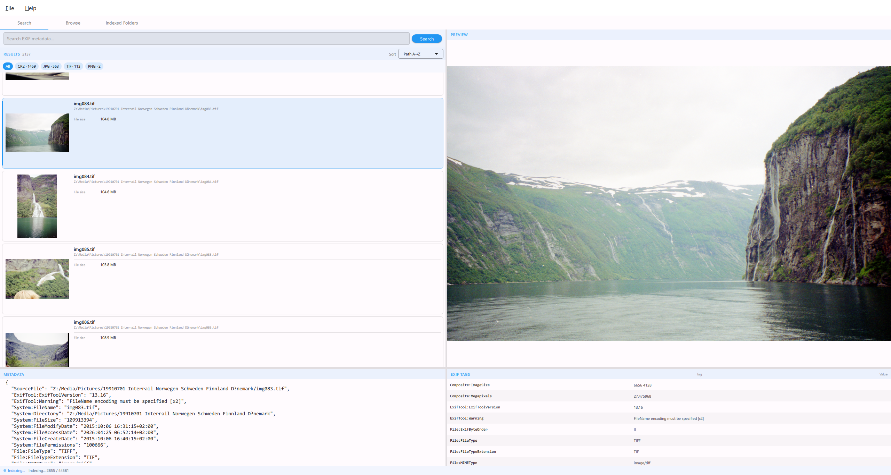
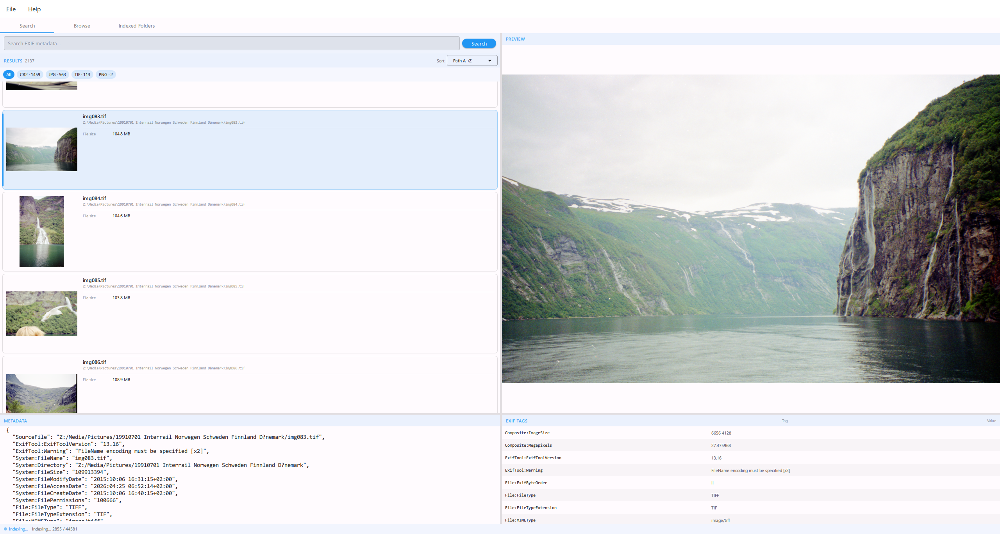
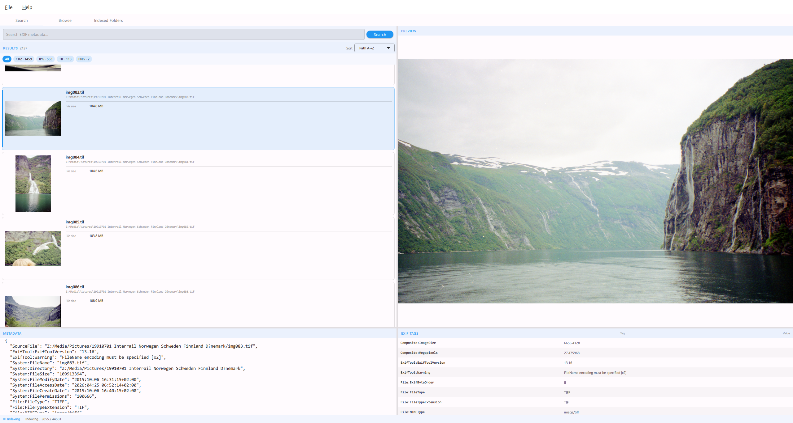

# exif-turbo User Manual

**exif-turbo** lets you scan image folders, build a searchable index of all EXIF
metadata, and instantly find any photo by camera model, lens, date, location, or any
other tag — across thousands of images.

---

## Table of Contents

1. [Requirements](#1-requirements)
2. [Installation](#2-installation)
3. [First Launch — Unlocking the Database](#3-first-launch--unlocking-the-database)
4. [Indexed Folders — Managing Your Library](#4-indexed-folders--managing-your-library)
5. [Indexing Progress](#5-indexing-progress)
6. [Searching](#6-searching)
7. [Browsing by Folder](#7-browsing-by-folder)
8. [Viewing Metadata and EXIF Tags](#8-viewing-metadata-and-exif-tags)
9. [Keyboard Shortcuts](#9-keyboard-shortcuts)
10. [CLI Indexer](#10-cli-indexer)
11. [FAQ](#11-faq)

---

## 1. Requirements

### ExifTool

exif-turbo requires **ExifTool** on your `PATH` to extract metadata from images.

| Platform | Install |
|----------|---------|
| **Windows** | Download the standalone `.exe` from [exiftool.org](https://exiftool.org/), rename to `exiftool.exe`, place in a folder on your `PATH` |
| **macOS** | `brew install exiftool` |
| **Linux** | `sudo apt install libimage-exiftool-perl` |

---

## 2. Installation

### Windows installer (recommended)

Download `exif-turbo-<version>-windows.msi` from the
[Releases page](https://github.com/baddonkey/exif-turbo/releases).
The installer adds an entry to **Start Menu** and puts `exif-turbo` on your `PATH`.

### From source

```bash
pip install -e .
```

---

## 3. First Launch — Unlocking the Database

When you start exif-turbo you are greeted by the **lock screen**:


Enter a password to protect the index database and click **Unlock** (or press
Enter). The same password is required every time you open the app.

> **Tip:** If you have no sensitive data and don't need encryption, leave the
> password field blank and click Unlock — the database will be created with no
> password.

Once unlocked, the **Search** tab opens and any previously indexed images are
immediately available.

---

## 4. Indexed Folders — Managing Your Library

Click the **Indexed Folders** tab to manage which directories are scanned.


### Adding a folder

1. Click **Add Folder** (top-right of the Indexed Folders tab).
2. Pick the directory in the file browser dialog.
3. The folder appears in the list with status **new**.

### Starting an index scan

Click **Rescan** next to a folder (or **Rescan All** to queue all folders).
The folder status changes to **scanning** and the progress panel appears in the
bottom-right corner of the tab.

Use **Full Rescan** to force every file to be re-processed even if its
modification time has not changed.

### Folder statuses

| Status | Meaning |
|--------|---------|
| **new** | Added but never scanned |
| **queued** | Waiting in the scan queue |
| **scanning** | Currently being indexed |
| **ok** | Last scan completed successfully |
| **error** | Last scan ended with an error |
| **disabled** | Excluded from search results |

### Disabling / enabling a folder

Toggle the **Enabled** switch to exclude a folder from search results without
deleting it or its index data.

### Removing a folder

Click **Remove**. The folder and all its indexed images are deleted from the
database. The original files on disk are not touched.

---

## 5. Indexing Progress

While scanning, a non-blocking progress panel appears in the bottom-right corner
of the **Indexed Folders** tab:

- **Queue indicator** — shows which folder in the queue is currently being scanned
  (e.g. "2 of 5").
- **Progress bar** — percentage of files processed in the current folder.
- **File counter** — `n / total` files scanned.
- **Current file** — name of the file being processed.
- **Cancel** button — stops indexing immediately.

Across **all tabs** the **status bar** at the very bottom of the window shows a
pulsing blue dot and the text **Indexing…** whenever a scan is in progress, so
you always know the indexer is running even when you are working in Search or
Browse.

### Pause and resume

If you close the application while indexing is in progress, the current folder
is saved as **queued**. The next time you open exif-turbo and unlock the
database the scan queue is automatically restored and indexing resumes where
it left off.

---

## 6. Searching

The **Search** tab is the main way to find photos:



### Running a search

Type any word or phrase into the **Search EXIF metadata…** bar and press
**Enter** (or click **Search**). exif-turbo performs a full-text search across
every metadata field — camera make and model, lens name, date, GPS coordinates,
keywords, copyright, and more.

Press **Enter** with an empty search bar to show all indexed images.

### Filtering by format

Below the search bar a row of format chips lists every file type present in the
results. Click a chip to show only that format:

```
All   CR2 · 1 459   JPG · 563   TIF · 113   PNG · 2
```

Click **All** to return to unfiltered results.

### Sorting results

Use the **Sort** dropdown at the top-right of the results panel:

| Option | Description |
|--------|-------------|
| Name A→Z | Filename ascending |
| Name Z→A | Filename descending |
| Path A→Z | Full path ascending |
| Path Z→A | Full path descending |
| Newest first | Date taken, most recent first |
| Oldest first | Date taken, oldest first |
| Largest | File size, largest first |

### Search examples

| Query | What it finds |
|-------|---------------|
| `Canon EOS R5` | All images shot with a Canon EOS R5 |
| `f/1.4` | All images taken at f/1.4 aperture |
| `Switzerland 2024` | Images with Switzerland and 2024 in any metadata field |
| `eagle` | Images whose filename, title, or keywords mention eagle |
| `Nikon Z 9 ISO 6400` | Nikon Z 9 shots at ISO 6400 |

---

## 7. Browsing by Folder

The **Browse** tab gives you a folder-tree view of all indexed images:



Expand the folder tree on the left to navigate your library hierarchy. Click
any folder to show only the images inside it. The same thumbnail list, preview
pane, and metadata panels appear as in Search.

---

## 8. Viewing Metadata and EXIF Tags

Selecting any image in the result list populates three panels:



### Preview

The right pane shows a full-resolution preview of the selected image scaled
to fit the available space. For RAW files (CR2, CR3, NEF, ARW, DNG, etc.) the
embedded preview JPEG is used.

### Metadata panel (bottom-left)

Shows the raw JSON metadata for the selected image as formatted text. Use
**Ctrl+F** to open an inline search bar and find any tag value. Press **F3**
(or click the arrows) to jump through all matches.

### EXIF Tags panel (bottom-right)

Displays the same metadata as a clean two-column table — **Tag** and **Value**
— sorted alphabetically.

You can drag the divider between the two bottom panels to adjust the split.
By default they start at **50 % / 50 %**.

---

## 9. Keyboard Shortcuts

| Shortcut | Action |
|----------|--------|
| `Enter` | Run search |
| `Ctrl+F` | Open / close find-in-metadata bar |
| `F3` | Jump to next match in metadata |
| `Shift+F3` | Jump to previous match in metadata |
| `Ctrl+Q` | Quit |

---

## 10. CLI Indexer

exif-turbo ships a headless CLI indexer for scripted or server use:

```bash
exif-turbo-index --folders "Z:\Photos\2024" --db "C:\Data\index.db"
```

### Options

| Flag | Description |
|------|-------------|
| `--folders` | One or more space-separated folder paths to index |
| `--db` | Path to the database file (created if it does not exist) |
| `--key` | Database encryption password (default: empty) |
| `--workers` | Number of parallel extraction threads (default: CPU count, max 12) |
| `--force` | Re-index all files, even if unchanged |
| `--include-dotfiles` | Index files whose names start with `.` (default: skipped) |

### Example — index multiple folders

```bash
exif-turbo-index \
  --folders "Z:\Photos\2024" "Z:\Photos\2025" \
  --db "C:\Data\photos.db" \
  --key "my-secret" \
  --workers 8
```

---

## 11. FAQ

**Q: Why does the status bar say "Indexing…" even after I switch tabs?**  
A: The indexer runs in the background across all tabs. The pulsing blue dot in
the status bar lets you know it is still working. You can continue searching
and browsing while indexing proceeds.

**Q: I closed the app mid-scan. Will I lose my progress?**  
A: No. exif-turbo saves the queue state when it closes. Next time you unlock the
database, any interrupted scans are automatically resumed.

**Q: The search finds nothing even though I can see files in the folder.**  
A: The files must be indexed first. Go to the **Indexed Folders** tab, add the
folder, and click **Rescan**.

**Q: Does exif-turbo modify my image files?**  
A: Never. exif-turbo only *reads* metadata — it never writes to your images.

**Q: What image formats are supported?**  
A: JPEG, PNG, TIFF, HEIC, BMP, GIF, and RAW formats: CR2, CR3, NEF, ARW, DNG,
ORF, RW2, PEF, RAF, RWL, SRW (and any other format that ExifTool can read).

**Q: Where is the database stored?**  
A: By default at `~/.exif-turbo/data/index.db` on all platforms. You can
specify a custom path with `--db` when launching the app or the CLI indexer.

**Q: How do I change the database password?**  
A: There is no in-app password change yet. Re-create the database by deleting
the `.db` file and re-indexing your folders with a new password.

**Q: Thumbnails are not showing / are slow to appear.**  
A: Thumbnails are generated in a background thread after indexing. Depending
on the number of images it may take a few minutes for all thumbnails to be
built and cached. They persist across sessions so subsequent launches are fast.
