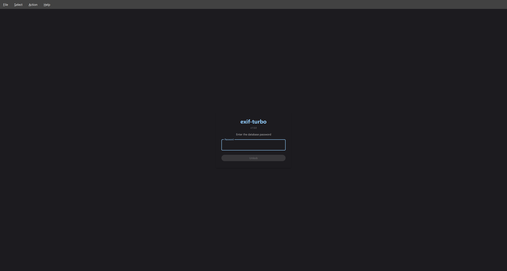
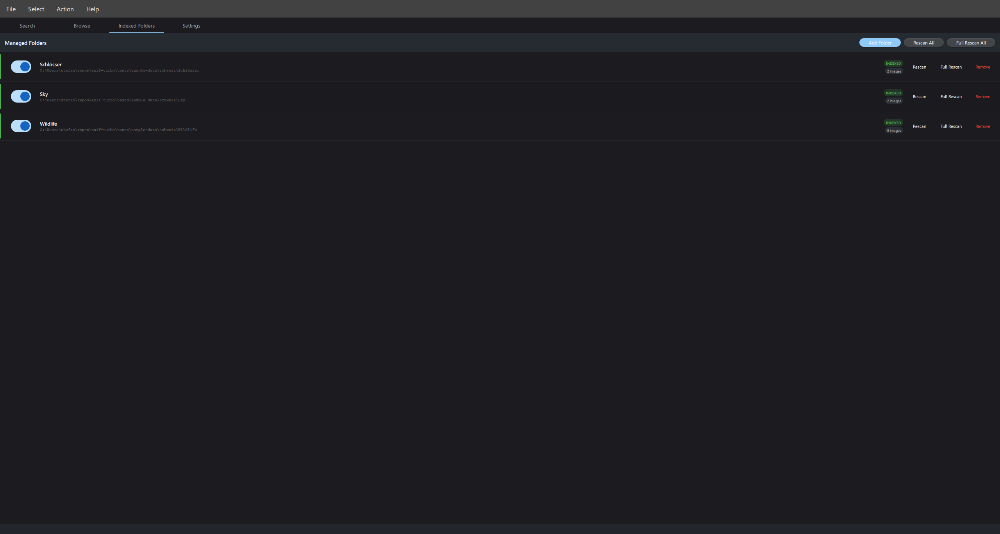
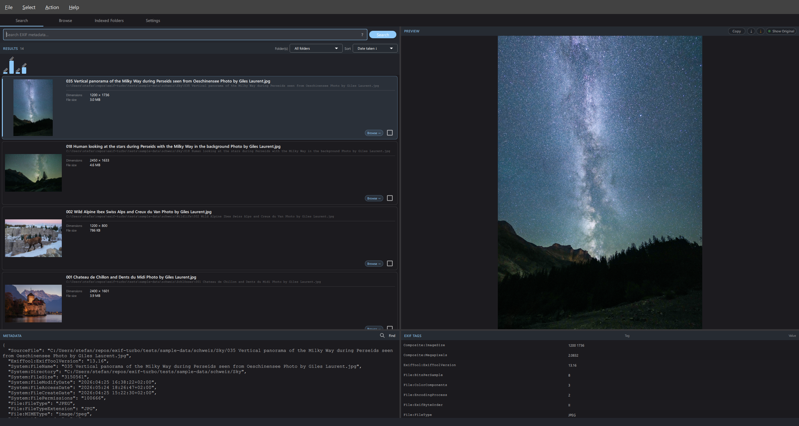
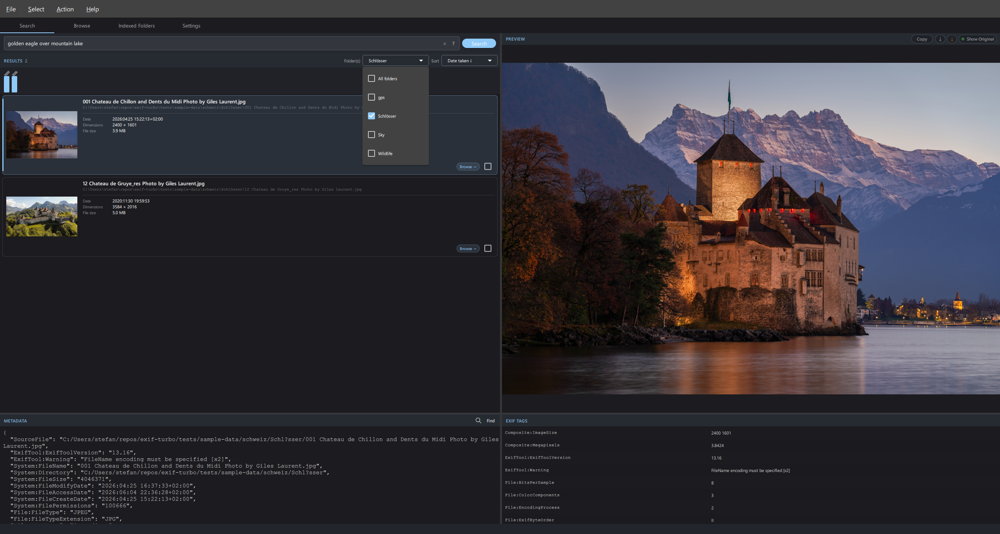
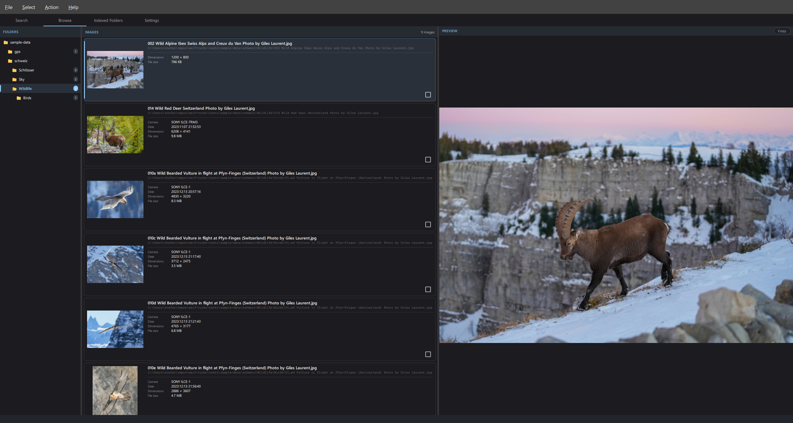
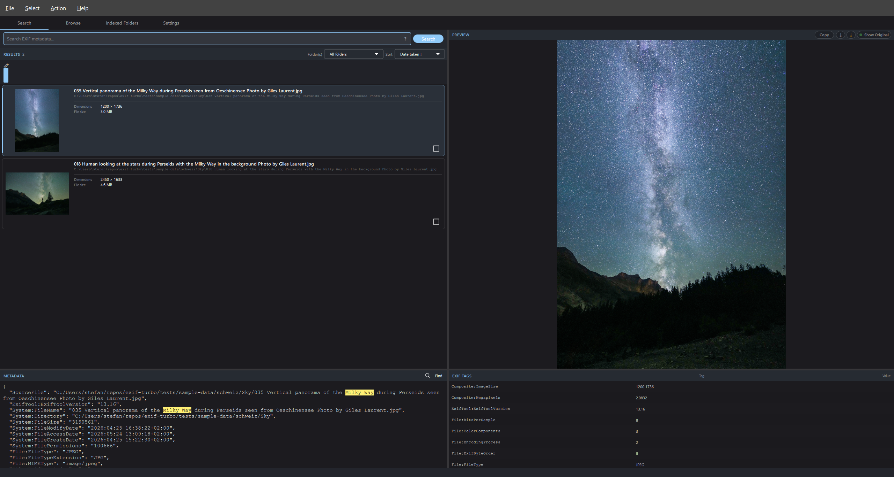
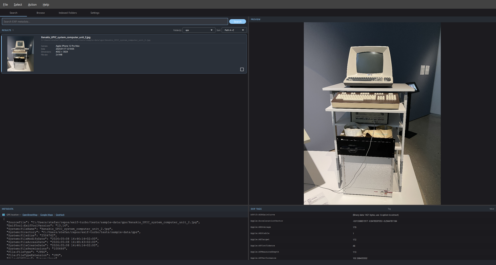

# exif-turbo User Manual

**exif-turbo** lets you scan image folders, build a searchable index of all EXIF
metadata, and instantly find any photo by camera model, lens, date, location, or any
other tag — across thousands of images. Video files (MP4, MOV, AVI, MKV, WMV,
M4V, MTS, M2TS, 3GP, WebM, FLV) are indexed alongside still images, with
thumbnails and previews extracted from the embedded thumbnail or a frame at
1/3 of the duration.

---

## Table of Contents

1. [Requirements](#1-requirements)
2. [Installation](#2-installation)
3. [First Launch — Unlocking the Database](#3-first-launch--unlocking-the-database)
4. [Indexed Folders — Managing Your Library](#4-indexed-folders--managing-your-library)
5. [Indexing Progress](#5-indexing-progress)
6. [Searching](#6-searching)
7. [Browsing by Folder](#7-browsing-by-folder)
8. [Viewing Metadata and EXIF Tags](#8-viewing-metadata-and-exif-tags)
9. [Marking Images & Bulk Actions](#9-marking-images--bulk-actions)
10. [Tagging with TGM](#10-tagging-with-tgm)
11. [Settings](#11-settings)
12. [Keyboard Shortcuts](#12-keyboard-shortcuts)
13. [FAQ](#13-faq)

---

## 1. Requirements

### ExifTool

exif-turbo requires **ExifTool** on your `PATH` to extract metadata from images.

| Platform | Install |
|----------|---------|
| **Windows (MSI)** | ExifTool is **bundled with the MSI installer** — no separate download needed. A system-wide `exiftool.exe` on your `PATH` takes priority if present. |
| **Windows (source)** | Download the standalone `.exe` from [exiftool.org](https://exiftool.org/), rename to `exiftool.exe`, place in a folder on your `PATH` |
| **macOS** | `brew install exiftool` (if Homebrew is not installed yet: `/bin/bash -c "$(curl -fsSL https://raw.githubusercontent.com/Homebrew/install/HEAD/install.sh)"`) |
| **Linux** | `sudo apt install libimage-exiftool-perl` |

---

## 2. Installation

### Windows installer (recommended)

Download `exif-turbo-<version>-windows.msi` from the
[Releases page](https://github.com/baddonkey/exif-turbo/releases).
The installer adds an entry to **Start Menu** and puts `exif-turbo` on your `PATH`.
ExifTool is **included in the MSI** — you do not need to download it separately.
If you already have ExifTool installed system-wide, that version takes priority.

### macOS installer

Download `exif-turbo-<version>-macos.dmg` from the same Releases page,
open it, and drag **exif-turbo.app** into your **Applications** folder.

### Linux package

Download either `exif-turbo_<version>_amd64.deb` (Debian/Ubuntu) or
`exif-turbo-<version>-1.x86_64.rpm` (Fedora/openSUSE) from the Releases page
and install it with your package manager:

```bash
# Debian / Ubuntu
sudo apt install ./exif-turbo_<version>_amd64.deb

# Fedora / openSUSE
sudo dnf install ./exif-turbo-<version>-1.x86_64.rpm
```

The package installs the application to `/opt/exif-turbo/`, registers a
desktop launcher, and creates a `/usr/bin/exif-turbo` symlink.

### From source

```bash
pip install -e .
```

### Command-line options

```
exif-turbo [--db NAME] [--version]
```

| Option | Description |
|--------|-------------|
| `--db NAME` | Open (or create) a named database instead of the default one. The database is always stored in `~/.exif-turbo/data/<NAME>/<NAME>.db`. Useful for keeping separate libraries — e.g. `exif-turbo --db work` and `exif-turbo --db holidays`. |
| `--version` | Print the installed exif-turbo version and exit. |

If `--db` is omitted, the default database `~/.exif-turbo/data/index/index.db` is used.

---

## 3. First Launch — Unlocking the Database

When you start exif-turbo you are greeted by the **lock screen**:



### First-time setup — creating a new database

If this is the first time you have launched exif-turbo (or you are using a new
named database), the lock screen shows a **New passphrase** field, a
**Confirm passphrase** field, and a **Create Database** button. Choose a strong
passphrase of at least 12 characters that mixes letters, numbers, and symbols —
it encrypts your entire image index and **cannot be recovered if lost**.

### Opening an existing database

Enter your password in the **Password** field and click **Unlock** (or press
**Enter**). The same password is required every time you open the app.

Once unlocked, the **Search** tab opens and any previously indexed images are
immediately available.

> **ExifTool not found:** If ExifTool is not installed or not on your `PATH`
> at the time of unlock, a **"ExifTool not found"** dialog appears automatically.
> It explains that indexing is disabled and provides a link to
> [exiftool.org](https://exiftool.org/). Install ExifTool and restart the app
> to enable indexing. You can still search and browse existing index data while
> ExifTool is missing.

### Help menu

The **Help** menu in the menu bar provides access to this user manual, the
third-party open-source licence list, and the **About** dialog, which shows the
application version, a brief description of the application, and the licence (MIT).

---

## 4. Indexed Folders — Managing Your Library

Click the **Indexed Folders** tab to manage which directories are scanned.



### Adding a folder

1. Click **Add Folder** in the **Managed Folders** header bar at the top of the
   tab.
2. Pick the directory in the file browser dialog.
3. The folder is immediately queued for scanning — its status changes to **QUEUED**
   then **SCANNING** once the worker starts.

The header bar also provides **Rescan All** (incrementally re-index all enabled
folders) and **Full Rescan All** (force re-extract EXIF for every file in all
enabled folders).

### Starting an index scan

Click **Rescan** next to a folder (or **Rescan All** to queue all enabled folders).
The folder status changes to **SCANNING** and the progress panel appears in the
bottom-right corner of the tab.

Use **Full Rescan** (or **Full Rescan All**) to force every file to be
re-processed even if its modification time has not changed. This is useful after
updating ExifTool or if you suspect the index is out of date.

When rescanning a single folder, only the records belonging to that folder are
updated or removed. Images indexed from other folders are not affected.

### Folder statuses

Each folder row shows a coloured status badge, an image-count badge
(e.g. "42 images") once it has been indexed, and — if previews have been
rendered — a preview-cache badge ("✓ 42/42 previews"). The preview badge is
**green** when every image in the folder has a cached preview and **amber**
when only some do; hover it to see the exact ratio.

| Status | Meaning |
|--------|---------|
| **NEW** | Added but never scanned |
| **QUEUED** | Waiting in the scan queue |
| **SCANNING** | Currently being indexed |
| **INDEXED** | Last scan completed successfully |
| **MISSING** | Folder path no longer exists on disk |
| **ERROR** | Last scan ended with an error |
| **DISABLED** | Excluded from search results |

### Disabling / enabling a folder

Toggle the **Enabled** switch to exclude a folder from search results without
deleting it or its index data. Hovering the switch shows the tooltip *"Folder
is included in search results"* (when on) or *"Folder is excluded from search
results"* (when off).

### Per-folder actions

Each row exposes the following buttons on the right:

| Button | Action |
|--------|--------|
| **Rescan** | Incrementally re-index this folder (only files whose modification time changed). |
| **Full Rescan** | Force re-extract EXIF for every file in this folder. |
| **Build Previews** | Render preview-cache JPEGs for every image in this folder. While the build is running on this folder the same button reads **Cancel Previews**. Disabled while another folder's preview build is in progress. |
| **AI-Scan** | Build missing CLIP vector embeddings for this folder only (incremental semantic-index build). While running, the same button reads **Cancel AI-Scan**. Visible only when AI features are enabled in Settings. |
| **AI Full Rescan** | Rebuild every CLIP vector embedding for this folder from scratch. While running, the same button reads **Cancel AI Full Rescan**. Visible only when AI features are enabled. |
| **Clear Previews** | Delete all cached previews for this folder. Hidden (kept invisible for layout alignment) when nothing is cached. A confirmation dialog asks *"Delete N cached preview(s) for \"<folder>\"? Thumbnails are unaffected."* |
| **Remove** | Remove the folder and delete all its indexed images. A **Remove Folder** confirmation dialog asks before deletion. The original files on disk are not touched. The removal then runs on a background worker behind the modal **bulk-op progress overlay** (see [section 9](#9-marking-images--bulk-actions)), which reports each sub-step — *"Clearing preview cache…"* (cancelable, with an `X / Y` count) followed by *"Deleting index entries…"*. |

---

## 5. Indexing Progress

While scanning, a non-blocking progress panel appears in the bottom-right corner
of the **Indexed Folders** tab. The same panel is reused for the two background
phases that may follow indexing — **thumbnail building** and **preview
building** — so it can show three different titles:

- **"Indexing folder N of M"** / **"Indexing"** — file-indexing phase. Shown
  while the indexer is processing folders from the queue.
- **"Building Thumbnails"** — thumbnail-cache phase, started automatically
  after indexing finishes.
- **"Building Previews"** — preview-cache phase, started by the **Build
  Previews** button on a folder row.

The panel always contains:

- **Progress bar** — indeterminate while the total is still being computed,
  then a percentage once it is known.
- **Count label** — **"Scanning for images…"** at the start of indexing
  discovery; **"N indexed, scanning…"** while indexing has started but the
  total file count is not yet known; **"Preparing…"** for the thumbnail and preview
  phases before the total is known; then `n / total files` (indexing) or
  `n / total images` (thumbnails and previews).
- **Current file** — name of the file being processed.
- **Cancel button** — labelled **Cancel Indexing**, **Cancel Thumbnails**,
  or **Cancel Previews** depending on the phase. While an indexing or thumbnail
  cancel is in flight the label changes to **"Canceling…"** and the button is
  disabled until the worker has stopped.

Across **all tabs** the **status bar** at the very bottom of the window shows a
pulsing blue dot and the text **Indexing…** during the file-indexing phase, so
you always know the indexer is running even when you are working in Search or
Browse. The dot is not shown during the separate thumbnail-building phase. The
status bar also shows brief event messages to its right (such as "Indexed 42
images" after a scan completes).

### Self-healing cache cleanup

At the end of every successful folder index run, exif-turbo runs a quick
garbage-collection pass over the thumbnail and preview cache directories.
Any cached file whose source image is no longer present in the index (because
the file was deleted, moved, or renamed since the last scan) is removed. The
status bar shows **“Cleaning up cache…”** while the sweep runs. This keeps the
cache compact and self-heals across crashes or external file deletions, so
you never need to manually clear the cache directory.

### Pause and resume

If you close the application while indexing is in progress, the current folder
is saved as **QUEUED**. The next time you open exif-turbo and unlock the
database the scan queue is automatically restored and indexing resumes where
it left off.

---

## 6. Searching

The **Search** tab is the main way to find photos:



*Photos: © [Giles Laurent](https://gileslaurent.com), [CC BY-SA 4.0](https://creativecommons.org/licenses/by-sa/4.0/)*

### Running a search

Type any word or phrase into the **Search EXIF metadata…** bar and press
**Enter** (or click **Search**). exif-turbo performs a full-text search across
every metadata field — camera make and model, lens name, date, GPS coordinates,
keywords, copyright, and more.

Press **Enter** with an empty search bar to show all indexed images.

A **`?`** button at the right edge of the search field shows a syntax
cheat-sheet when hovered. It lists six examples (single token, implicit AND,
OR, NOT, exact phrase, prefix wildcard) and a short tips section. You do not
need to click it — the tooltip appears automatically on hover.

When the search field contains text a **`×`** button appears to its left.
Clicking it clears the field and immediately shows all images (equivalent to
pressing **Enter** with an empty bar).

While a search is running, a semi-transparent grey overlay dims the entire UI
and the cursor changes to a busy indicator. The overlay clears automatically
when results are ready.

### AI semantic search (EXIF/AI toggle)

When **AI Features** are enabled in **Settings**, the search bar shows an
**EXIF / AI** toggle. Switch to **AI** mode to search by meaning instead of
exact metadata terms.


In AI mode:

1. Enter a natural-language query such as *"golden eagle over mountain lake"*.
2. Press **Enter** (or click **Search**) to run CLIP semantic retrieval.
3. Choose a precision level:
  - **Fine**: strictest matches (score >= 0.22)
  - **Normal**: balanced default (score >= 0.20)
  - **Broad**: most permissive (score >= 0.18)

AI search requires CLIP vectors to exist for the target images.
Build them with **AI-Scan** (or **AI Full Rescan**) in the
**Indexed Folders** tab.

Note for macOS Intel users: AI features are unavailable on macOS Intel (x86_64)
targets and are shown disabled in **Settings**. This is due to PyTorch support
for Python 3.13+ on that platform.

### Filtering by format

When results contain more than one file format, a row of format chips appears
below the search bar. Click a chip to show only that format:

```
All   CR2 · 1459   JPG · 563   TIF · 113   PNG · 2
```

Click **All** to return to unfiltered results.

### Filtering by folder

When you have two or more indexed folders enabled, a **Folder(s)** dropdown
appears in the RESULTS header bar, to the left of the **Sort** control. It is
hidden when only one folder is indexed.

The button label reflects the current filter state:

| Label | Meaning |
|-------|---------|
| **All folders** | No folder filter — results span all enabled folders |
| _Folder name_ | Exactly one folder is selected |
| **N folders** | N individual folders are selected |

Click **Folder(s)** to open the selection popup. Tick **All folders** to clear
any active filter; tick one or more folder names to restrict results to those
folders only. Multiple folders can be selected simultaneously. Hovering over a
folder name shows its full path as a tooltip.

> **Drive roots on Windows** — when an entire drive (e.g. `C:\`) is added as
> an indexed folder it appears in the dropdown with a friendly label such as
> **"OS (C:)"** (volume name + drive letter), rather than a blank entry.



### The selection chip

Whenever at least one image is marked (or the marked-only filter is active), a
**selection chip** appears in the RESULTS header bar next to the **Folder(s)**
dropdown. It shows the current marked count:

| Label | Meaning |
|-------|---------|
| `☑ N` | Every marked image is in the current results |
| `☑ here/total` | Only some marked images match the current filters (e.g. `☑ 12/87`) |

Click the chip to toggle the **marked-only filter** — the tooltip switches
between *"Show only selected images"* and *"Show all results"*. While the
filter is active the chip stays highlighted so you always know which view
you are looking at.

*Photos: © [Giles Laurent](https://gileslaurent.com), [CC BY-SA 4.0](https://creativecommons.org/licenses/by-sa/4.0/)*

### Sorting results

Use the **Sort** dropdown at the top-right of the results panel:

| Option | Description |
|--------|-------------|
| Date taken ↓ | EXIF capture date, newest first (default) |
| Date taken ↑ | EXIF capture date, oldest first |
| Name A→Z | Filename ascending |
| Name Z→A | Filename descending |
| Path A→Z | Full path ascending |
| Path Z→A | Full path descending |
| Largest | File size, largest first |
| Smallest | File size, smallest first |

**Date taken ↓/↑** sorts by the capture timestamp stored during indexing.
exif-turbo resolves this timestamp from a prioritised chain: primary EXIF
fields (`DateTimeOriginal`, `CreateDate`) are tried first; if none are present,
XMP, IPTC, and QuickTime creation fields are consulted; as a last resort the
file-system creation time (macOS/Windows) or modification time (Linux) is used.
Infrastructure metadata such as ICC colour-profile dates is never used.
Images with no resolvable date appear at the end of the list in both directions.

The chosen sort order is remembered per database and restored automatically
the next time you open the application.

### Filtering by capture year

Whenever at least one indexed image has a known capture date a **year histogram**
appears below the format chips in the Search tab. Each bar represents one
calendar year; its height is proportional to the number of matching images taken
in that year relative to the busiest year.

| Action | Effect |
|--------|--------|
| **Click a bar** | Filter results to images captured in that year |
| **Shift-click a different bar** | Extend the selection to cover the range between the two bars |
| **Click the active bar again** | Clear the year filter |
| **× chip** (right side of histogram) | Clear the year filter |

A tooltip on each bar shows the year and image count. When a filter is already
active, hovering a bar that is not the sole selected year shows "Shift-click to
extend range".

Images that have no resolvable capture date are excluded from results while a
year filter is active.

### Loading more results

Results are loaded in batches as you scroll. When you reach the bottom of the
result list the next batch is fetched automatically. The total match count is
shown next to the **RESULTS** badge in the panel header.

### Opening images from results

**Single-click** a result card to select it and load the preview and metadata
panels.

**Double-click** a result card to open the file or folder in your system's
default application:
- Double-clicking the **thumbnail** (left side of the card) opens the image
  in your default image viewer.
- Double-clicking the **info area** (right side of the card) opens the parent
  folder in the system file manager. On Windows, Explorer opens with the file
  highlighted; on macOS and Linux the parent folder is opened.

If the original file cannot be reached — for example when the folder that
contains it is not currently mounted or attached — nothing is opened and a
**red warning** appears in the status bar at the bottom of the window naming
the indexed folder you need to (re)attach or mount, e.g. *"Original data
source not attached: D:\Photos — attach or mount this folder to open files."*

### Search examples

| Query | What it finds |
|-------|---------------|
| `Canon EOS R5` | All images shot with a Canon EOS R5 |
| `f/1.4` | All images taken at f/1.4 aperture |
| `Switzerland 2024` | Images with Switzerland and 2024 in any metadata field |
| `eagle` | Images whose filename, title, or keywords mention eagle |
| `Nikon Z 9 ISO 6400` | Nikon Z 9 shots at ISO 6400 |

### Advanced query syntax

The search box accepts the full **SQLite FTS5** query language:

| Syntax | Example | What it does |
|--------|---------|--------------|
| `term` | `Canon` | Keyword anywhere in metadata |
| `"exact phrase"` | `"red deer"` | Terms must appear adjacent and in order |
| `term1 AND term2` | `Canon AND 50mm` | Both terms must be present |
| `term1 OR term2` | `Canon OR Nikon` | Either term must be present |
| `term1 NOT term2` | `50mm NOT Nikon` | First term present, second term absent |
| `prefix*` | `Fuji*` | Matches any token starting with the prefix |

Multiple terms without an operator (`Canon 50mm`) are treated as an implicit AND.

ExifTool stores metadata with group-prefixed keys such as `GPS:GPSLatitude` or
`ExifIFD:FocalLength`. You can type these directly in the search box — the colon
is treated as a word separator, so `GPS:GPSLatitude` becomes an implicit AND
of `GPS` and `GPSLatitude`.

---

## 7. Browsing by Folder

The **Browse** tab lets you navigate your library by folder hierarchy:



*Photos: © [Giles Laurent](https://gileslaurent.com), [CC BY-SA 4.0](https://creativecommons.org/licenses/by-sa/4.0/)*

The left panel shows all indexed folders as an indented list — sub-folders are
indented under their parent. Each entry shows the folder name and a count of
images inside it. Click any folder to show only its images in the centre panel.
Click the highlighted folder again to deselect it and show all images.

The same thumbnail list and preview pane appear as in Search. **Single-click**
an image to select it and load the preview. The preview supports the same
zoom and pan gestures as in Search (scroll wheel, touchpad scroll, touchpad
pinch-to-zoom, drag-to-pan, double-tap to reset — see
[Zooming and panning](#zooming-and-panning)). **Double-click** an image to open
it in your system's default viewer. (Unlike the Search tab, double-clicking in
Browse always opens the image — there is no folder-open shortcut.)

The Browse tab shows the same **METADATA** and **EXIF TAGS** panels as the
Search tab, including the GPS location bar. They appear in a split view below
the image list and preview panel. The inline **Ctrl+F** find bar works on the
Browse tab too — click **Find** in the METADATA panel header (or press
**Ctrl+F** when the Browse tab is active) to search within the metadata text.

The Browse tab preview pane has the same toolbar pill buttons as the Search tab:

- **Copy** — copies the currently displayed preview image to the system
  clipboard. A brief toast notification confirms the action.
- **Save Preview As** (white ⤓) — opens a **Save File** dialog to save the
  preview as JPEG or PNG.
- **Save Original As** (orange ⤓) — copies the original source file
  byte-for-byte to a destination you choose.
- **Show Original / Show Preview** toggle — switches between the cached preview
  (green dot) and the full-resolution source file (orange dot). Only shown when
  the selected image has a cached preview.

While a full-resolution original is loading, a **"Loading original…"** spinner
overlay appears over the preview area (only when **Show Original** is active).

### Navigating the Browse image list

The image list takes keyboard focus as soon as a folder is selected. You can
move through images without touching the mouse:

| Key | Action |
|-----|--------|
| `↓` | Select the next image |
| `↑` | Select the previous image |
| `Page Down` | Jump one page forward |
| `Page Up` | Jump one page backward |

A permanently visible vertical scrollbar (12 px) is always shown on the right
edge of the list so you can drag it or click to jump to any position without
first hovering the right edge.

### Search-tab filter state is preserved

The Browse tab has its own independent navigation context. When you switch from
Search to Browse and back, your active Search query, format chip, date range,
sort order, extension filter, and folder filters are all restored exactly as
you left them — Browse navigation never affects the Search state.

Switching back to the **Search** tab restores the search state exactly as you
left it. Any image previously selected while browsing is not automatically
highlighted in Search.

### Jumping between Search and Browse

Each result card in the **Search** tab has a **Browse →** pill button in its
bottom-right corner (to the left of the selection checkbox). Clicking it:

1. Switches to the **Browse** tab.
2. Navigates to the folder that contains that image.
3. Scrolls the Browse image list to that exact image and selects it.

The Browse tab image list header has a **← Search** back button. Clicking it
returns to the **Search** tab and restores the exact scroll position and
previously-selected image — no need to re-enter the search query.

---

## 8. Viewing Metadata and EXIF Tags

Selecting any image in the result list populates three panels:



*Photo: © [Giles Laurent](https://gileslaurent.com), [CC BY-SA 4.0](https://creativecommons.org/licenses/by-sa/4.0/)*

### Preview

The right pane shows a full-resolution preview of the selected image scaled to
fit the available space. For RAW files (CR2, CR3, NEF, ARW, DNG, etc.) the
embedded preview JPEG is used. A cached thumbnail is shown immediately as a
low-resolution placeholder while the full image is loading; the full image fades
in once it has been decoded.

#### Show Preview / Show Original

When the selected image has a cached preview JPEG, a small pill toggle appears
at the right edge of the **PREVIEW** header bar. The label tells you what
clicking it will do:

- **Show Original** (with a green dot) — you are currently looking at the
  cached preview; click to load the full-resolution source file.
- **Show Preview** (with an orange dot) — you are currently looking at the
  full-resolution source; click to switch back to the cached preview.

The pill is useful for RAW files: the cached preview decodes instantly and is
sufficient for most viewing, but switching to **Show Original** loads the
full-resolution image when you want to zoom in for detail. The toggle is hidden
when no cached preview is available for the selected image.

While a full-resolution original is loading, a small **"Loading original…"**
overlay with a spinner appears over the preview area so you know the image is
being decoded (large RAW files may take a few seconds).

> The **Show Preview / Show Original** toggle is available in both the
> **Search** and **Browse** tabs.

#### Copying the preview image

You can copy the currently displayed preview image to the system clipboard in
two ways:

- Click the **Copy** pill button in the **PREVIEW** header bar toolbar
  (the leftmost of the pill buttons).
- **Right-click** anywhere on the preview image and choose
  **Copy Image to Clipboard** from the context menu.

Both actions are available in the **Search** and **Browse** tabs. A brief
toast notification at the bottom of the window confirms that the image has
been placed on the clipboard. If rendering fails for any reason, the file
path is copied as plain text instead.

#### Saving the preview image

A **Save Preview As** button (white ⤓) appears in the **PREVIEW** header bar
toolbar — the second pill from the left — when an image is selected. Clicking
it opens a native **Save File** dialog with the filename pre-filled as
`<stem>_preview.jpg`, where `<stem>` is the original file's base name without
its extension. The available save formats are:

- **JPEG** (`.jpg` / `.jpeg`)
- **PNG** (`.png`)

The saved image is the currently displayed preview. If the **Show Original**
toggle is active, the high-resolution source is used; otherwise the cached
preview JPEG is saved.

A brief toast notification **"Preview saved"** confirms the export.

You can also trigger this action by right-clicking anywhere on the preview
image and choosing **Save Preview As…** from the context menu.

#### Saving the original file

A **Save Original As** button (orange ⤓) appears in the **PREVIEW** header bar
toolbar — the third pill from the left — when an image is selected. Clicking
it opens a native **Save File** dialog with the original filename pre-filled as
the suggested name. The source file is copied byte-for-byte to the chosen
destination — no re-encoding takes place.

A brief toast notification **"Original saved"** confirms the copy.

You can also trigger this action by right-clicking anywhere on the preview
image and choosing **Save Original As…** from the context menu.

#### Recreate Thumbnail / Recreate Preview

The preview context menu (right-click on the preview image) also offers two
rebuild actions, useful when a cached thumbnail or preview ever looks wrong
(for example a video frame that was extracted before the rotation fix):

- **Recreate Thumbnail** — deletes the cached thumbnail for the selected
  image (including any `.skip` sentinel that previously marked it as
  unthumbnailable) and re-queues thumbnail generation. The thumbnail in the
  left-hand result grid refreshes automatically as soon as the new file is
  written — you do not need to switch images or restart the app.
- **Recreate Preview** — deletes the cached preview JPEG for the selected
  image. The preview pane re-renders the image immediately on next display.

Both actions only affect the selected image; other cached thumbnails and
previews are left untouched.

#### Zooming and panning

The preview supports cursor-anchored zoom and drag-to-pan:

| Input | Action |
|-------|--------|
| **Ctrl + scroll wheel** (mouse) | Zoom in / out, anchored to the cursor position |
| **Ctrl + two-finger scroll** (touchpad) | Zoom in / out, anchored to the cursor position |
| **Touchpad — pinch** | Zoom in / out, anchored to the pinch centroid |
| **Click and drag** / **two-finger drag** | Pan the zoomed image in any direction |
| **Plain scroll wheel / two-finger scroll** | Pan vertically when zoomed in |
| **Double-click** / **double-tap** | Reset zoom to fit |

Zoom is capped at **16×**. A badge in the bottom-right corner of the preview shows
the current zoom level when it is above 1×. Selecting a new image always resets
the zoom to fit.

### Metadata panel (bottom-left)

Displays the metadata for the selected image as formatted, indented JSON. Click
the **Find** button in the panel header (or press **Ctrl+F**) to open an inline
search bar and find any tag value. Press **F3** (or click the ▼ / ▲ arrows) to
jump through all matches. Search terms from the main search bar are highlighted
automatically.

#### GPS location bar

When the selected image contains GPS coordinates in its EXIF metadata, a thin
bar appears directly below the **Find** bar. It shows a 🗺 icon, a
**"GPS location —"** label, and three links you can click to view the location
on a map:

| Link | Service |
|------|---------|
| **OpenStreetMap** | Opens the coordinates on [OpenStreetMap](https://www.openstreetmap.org) at zoom level 14 |
| **Google Maps** | Opens the coordinates in [Google Maps](https://www.google.com/maps) |
| **GeoHack** | Opens the [Wikimedia GeoHack](https://geohack.toolforge.org) coordinate hub — lists nearby Wikipedia articles and dozens of map services |

The bar is hidden when the selected image has no GPS data, or when nothing is
selected. Hovering over a link shows the full URL in a tooltip.



### EXIF Tags panel (bottom-right)

Displays the same metadata as a clean two-column list, sorted alphabetically.
Hover over a truncated tag or value to see the full text in a tooltip.

You can drag the divider between the two bottom panels to adjust the split.
By default they start at **50 % / 50 %**.

---

## 9. Marking Images & Bulk Actions

Every result card has a **checkbox** in its bottom-right corner. Tick it to
*mark* that image — marks persist across searches, tab switches, and app
restarts (the state is stored in the encrypted database). The same checkbox
is present on the cards in the **Browse** tab, so you can mark images while
browsing as well as while searching. Marked images are the input for the
bulk actions in the **Action** menu.

The menu bar exposes two menus dedicated to marking and bulk actions.

### Select menu

| Action | What it does |
|--------|--------------|
| **Select All** | Marks every image matching the current filters (search query, format chip, folder filter, marked-only toggle). Runs on a background thread in batches so the UI stays responsive. |
| **Deselect All** | Unmarks every image matching the current filters. |
| **Invert Selection** | Flips the marked state of every image matching the current filters. |
| **Select Images Without Thumbnail** | Marks every matching image whose thumbnail has not been cached on disk yet. Images the thumbnailer has permanently given up on (oversized files or decoder errors, recorded as a `.skip` sentinel) are also marked, so you can act on them — for example by exporting the metadata or deleting the offending files. Like the other Select actions, it respects the active search query, format chip, folder filter, and marked-only toggle. |

All four actions show the **bulk-op progress overlay** with a live `X / Y`
counter and a **Cancel** button.

The same modal overlay is also reused for the two long-running maintenance
actions — **Remove Folder** (Indexed Folders tab) and **Reset Database**
(Settings tab). For those, the overlay adds a sub-step detail line describing
the current phase, and for phases that must not be interrupted (such as the
database vacuum during a reset) it hides the **Cancel** button and shows a
*"This step cannot be canceled…"* notice instead.

### Action menu

The Action menu operates on whatever is currently marked across the entire
database — not just the visible results.

| Action | What it does |
|--------|--------------|
| **Export Metadata as JSON…** | Writes the EXIF metadata of every marked image to a JSON file you choose via a Save dialog. The export honours the current **Sort** order (date taken, filename, path, or size). When nothing is marked, the menu label changes to *"Export Metadata as JSON… (all results)"* and the action exports every image matching the current filters instead. The on-disk layout is controlled by **Settings → JSON Export Formatting** (see *Settings*). |
| **Delete Marked Images…** | Permanently deletes every marked image **from disk** and removes its row from the index. Cached thumbnails (`.png` / `.enc`), `.skip` sentinels, and any rendered preview (`.jpg` / `.jpg.enc`) for the deleted images are also cleaned up. Disabled when nothing is marked. The menu label includes the current count, e.g. *"Delete Marked Images… (12 selected)"*. |

Both menu items report the live count in their label and run via the bulk-op
progress overlay; clicking **Cancel** mid-run stops cleanly and any deletions
already made stay on disk and in the index — the database is never out of
sync with the file system.

#### Confirming a delete

Because **Delete Marked Images…** is irreversible, the confirmation dialog
requires an extra step:

1. The dialog states how many files will be deleted (e.g.
   *"Permanently delete 12 marked image file(s) from disk and remove them
   from the index?"*).
2. A text field asks you to **type the exact count** — for example `12` —
   into the box labelled *"To confirm, type the number 12 below"*.
3. The **Yes** button stays disabled until the typed number matches the
   expected count exactly. Pressing **Enter** in the field also confirms
   the action when the count matches.
4. **Cancel** (or closing the dialog) aborts without deleting anything.

After completion the status bar reports the outcome, e.g.
**"Deleted 12 image(s)."** When some files were already gone or could not be
removed (for example because of file-system permissions) extra clauses are
appended: **"3 were already missing."** and/or **"1 could not be deleted."**

> **There is no undo.** Files are removed using the operating system's regular
> delete call — they do *not* go to the Recycle Bin / Trash. Make sure the
> marked set is correct before confirming.

### Tip — auto-sized menus

The Select and Action menu popups are sized to fit their longest item, so
dynamic labels such as *"Delete Marked Images… (1234 selected)"* are always
shown in full and never truncated.

---

## 10. Tagging with TGM

Tagging assigns controlled Library of Congress Thesaurus for Graphic Materials
(TGM) terms without writing metadata into the original image. It is disabled
by default for each database. Enable it under **Settings → Tagging and TGM**,
then click **Install TGM**. Installation downloads the official TGM v1 XML
distribution over HTTPS and falls back to the official tagged-text distribution
if XML cannot be downloaded or validated.

The application stores the normalized TGM snapshot and its checksum in the
current database's application-data directory. The source checksum records
provenance and detects changes; it is not a publisher signature. TGM content is
downloaded on demand rather than bundled while redistribution and attribution
requirements remain under review. See the LOC [TGM download
page](https://guides.loc.gov/tgm-i/download-tgm), [field
definitions](https://www.loc.gov/pictures/collection/tgm/fields.html), and
[application guidance](https://guides.loc.gov/tgm-i).

### Sidecars and search

The first accepted tag for `photo.jpg` creates `photo.jpg.sidecar.json` beside
the image. Sidecars are deterministic UTF-8 JSON and are the authoritative
store for accepted tags. They are plain text: SQLCipher database encryption
does **not** encrypt them, so they inherit the source folder's permissions and
backup policy. Tagging never changes the original image's bytes or timestamp.

Each accepted term stores a canonical ID such as `loc-tgm:tgm000001`, its
canonical label, subject or genre/form category, and acceptance provenance.
The importer supports the official TGM v1 XML and tagged-text structures.
Canonical descriptors use merged TGM `TNR` numbers; `UF` and non-descriptor
`USE` terms become aliases that resolve to the canonical concept. Only
postable subject (`TTCSubj`, MARC 150/650) and genre/form (`TTCForm`, MARC
155/655) concepts can be accepted.

Accepted canonical labels, qualified IDs, categories, vocabulary identity, and
known aliases are copied into the encrypted database's FTS5 cache. Search uses
the normal EXIF query box and syntax; pending and rejected proposals are not
searchable. A regular or full image scan synchronizes new, changed, or deleted
sidecars even when the original image stamp did not change. Malformed sidecars
are reported and left untouched.

Move or rename a sidecar together with its image. Version 1 does not infer an
external rename. Removing an image or indexed folder clears only database
cache rows; it does not delete a sidecar. Deleting a sidecar removes its
accepted tags from FTS after the next synchronization.

### Tagging drawer

From the **Search** or **Browse** tab, click the tag button at the upper right
or press **Ctrl+T**. The non-modal drawer contains these controls:

- **Add TGM term** searches canonical labels and aliases after a short delay.
  Click a result or the **+** button to add it to the focused image; the
  adjacent bulk button applies it to every marked image. **Enter** accepts the
  highlighted result, and **Down** moves through results.
- Choose **Current image** to tag only the focused image, or **Marked images**
  to apply every action to the marked set. The workbench shows only the tag
  list and commands for the chosen target.
- In **Current image** mode, the tag list shows that image's canonical tags,
  category, and provenance. The minus button removes a tag from that image.
- In **Marked images** mode, the tag list shows whether each term occurs on
  **all marked images** or on *N of M marked images*. The minus button removes
  that concept from all marked images.
- **Tag proposals** can generate suggestions for the selected image or all
  marked images. Each row shows its score and provider and has accept and
  reject buttons. Rejected proposals remain suppressed for the current TGM,
  prompt, and model fingerprint.
- **Auto-accept Marked** appears only when auto-accept is enabled. It asks for
  confirmation, regenerates proposals, and accepts only scores at or above the
  configured auto-accept threshold.
- **Tagged derivatives → Choose Output Folder** shows how many marked images
  have accepted tags and can be exported, then starts derivative generation
  after confirmation. The result lists the exact destination for a single
  created derivative and separately reports untagged images, existing files,
  and failures.

Long-running TGM, proposal, bulk-tag, and derivative operations show progress
and a **Cancel** button. Cancellation stops before the next item; completed
sidecar or derivative writes remain valid, and the final summary reports
successes, skips, conflicts, failures, or cancellations.

### Marks and bulk behavior

The drawer reuses the same persistent marks described in [section
9](#9-marking-images--bulk-actions); it does not maintain a second selection.
Press **Space** to toggle the focused image's mark. Bulk add and remove process
the enabled-folder marked set one image at a time. Existing tags are skipped,
external sidecar edits are reported as conflicts, and malformed or read-only
sidecars fail without replacing them. Auto-accept has an explicit confirmation;
the current bulk add/remove buttons do not show a separate confirmation dialog.

### CLIP proposal prerequisites

Manual TGM search and tagging do not require AI. Proposals do. They require:

1. **AI Features** enabled in Settings. This is unavailable on macOS Intel.
2. Image CLIP vectors built separately with **AI-Scan** or **AI Full Rescan**
   for the relevant indexed folder.
3. A separate TGM term-vector index built with **Build Vectors** under
   **Tagging and TGM**.

The image FAISS index remains image-only; TGM concepts are stored in a separate
FAISS index. Installing a new TGM snapshot makes term vectors stale and requires
**Rebuild Vectors**, but does not require rebuilding image vectors. Proposal
generation never scans original images implicitly: a missing image vector is
reported as requiring an AI scan.

The proposal threshold defaults to **0.24**. Optional auto-accept is off by
default and uses the stricter **0.32** threshold. The auto-accept threshold is
always kept at least 0.01 above the proposal threshold. Scores are model- and
dataset-dependent similarities, not calibrated probabilities; review results
before enabling automatic acceptance.

### Tagged derivatives

Derivative generation copies only marked images that have accepted tags. The
chosen output root must be outside every indexed source root. The exporter:

- preserves each source format and relative source folder tree;
- adds collision-safe top-level labels when marks span multiple indexed roots;
- skips untagged images and existing destination files without overwriting;
- writes accepted canonical labels to **XMP Subject** and **IPTC Keywords** on
  a temporary copy, verifies both fields with ExifTool, then publishes it;
- removes an incomplete temporary copy after a write or verification failure;
- never copies sidecars into the derivative tree.

Originals are explicitly forbidden as metadata-write targets. Other copied
metadata is preserved, but version 1 does not convert formats, provide custom
metadata mappings, or overwrite existing derivatives. Some source formats may
not support the requested writable metadata; those items are reported as
failures and the source remains unchanged.

### Lifecycle and reset

Disabling tagging hides the workbench but does not delete sidecars, proposals,
the installed TGM snapshot, or cached accepted tags. Already synchronized tags
remain searchable. Closing the app requests cancellation of running tagging
workers; completed item-level writes remain in place.

**Reset Database** clears image/tag/proposal rows, marks, indexed folders,
thumbnail and preview caches, and the per-database TGM snapshot and vector
index. It deliberately does not traverse source folders to delete adjacent
sidecars. The separate image AI index files are not explicitly deleted by
reset; use **AI Full Rescan** after rebuilding the image index when a clean
semantic index is required. Re-add and scan folders to synchronize sidecars,
then reinstall TGM before editing tags or generating proposals.

---

## 11. Settings

Click the **Settings** tab to configure application behaviour.

### Tagging and TGM

**Enable tagging for this database** controls the drawer UI. The section also
shows whether TGM is installed, subject and genre/form counts, source date,
checksum, and importer diagnostics. **Install TGM** / **Update TGM** validates
and atomically activates a new official snapshot; a failed update leaves the
previous snapshot active. **Build Vectors** / **Rebuild Vectors** creates the
separate CLIP TGM term index and is enabled only when AI is available and on.

**Proposal threshold** defaults to 24%. **Auto-accept proposals** is off by
default; when enabled, **Auto-accept threshold** defaults to 32% and must remain
strictly above the proposal threshold.

### Worker Threads

Controls the number of parallel threads used for indexing and thumbnail
generation. Higher values speed up processing on multi-core machines but use
more CPU and memory. The default is half the number of detected CPU threads.

### Preview Cache Size

Long-edge resolution used by the preview-cache builder. Larger values give
sharper detail when zooming but take more disk space and longer to render.
Choose a value (in pixels) from the dropdown — the change applies to
subsequently built previews; existing cached previews are unaffected until
you rebuild them via **Build Previews** on a folder row.

### libvips Allowed Extensions

Controls which file extensions may use the native libvips fallback for images
that are unusually large or cannot be decoded correctly by Pillow. The default
list covers JPEG, PNG, TIFF, WebP, and GIF. Add an extension such as `.bmp` only
when you need libvips support for that format; remove an extension to prevent
that format from reaching libvips. Normal Pillow decoding remains available.

Changes apply immediately and are stored per database. Operations that libvips
marks as untrusted remain blocked regardless of this list; adding an extension
does not weaken that mandatory protection.

### Indexing Blacklist

A list of file and folder name patterns to skip during indexing. Supports
wildcards: `*` matches any sequence of characters, `?` matches a single
character. Patterns are matched against individual file or folder names, not
full paths.

Examples: `@eaDir`, `*.tmp`, `Thumbs.db`

Changes to the blacklist take effect on the next rescan.

### JSON Export Formatting

Controls how the **Export Metadata as JSON…** action writes its output.

- **Pretty-print (indented) JSON** — off by default, which keeps the historical
  compact layout (the export is a JSON array with each record serialised on its
  own line). Turn it on to indent every record for easier human reading.
- **Indent style** — when pretty-printing is on, choose **Spaces** or **Tabs**.
- **Indent size** — when the style is **Spaces**, choose how many spaces make up
  one indentation level (2, 4, or 8).

Whatever the format, the file is always valid JSON that round-trips back to the
same records. The setting is stored per database and applies to the next export.

### Theme

Choose between **system** (follows OS dark/light mode), **light**, or **dark**.
The theme changes immediately.

### Language

Select the display language from the dropdown. A restart is required for the
language change to take full effect.

### ExifTool

Click **Check** to verify that ExifTool is installed and available on your
`PATH`. A colour-coded badge appears next to the button:

- **Green dot + "Found — ExifTool \<version\>"** — ExifTool was found and
  the version is shown.
- **Red dot + "Not found"** — ExifTool is missing. A download link
  ([exiftool.org](https://exiftool.org/)) and a restart hint are shown below
  the badge.

The badge is also populated automatically each time you unlock the database,
so you do not need to click **Check** after every launch.

### Change Password

Click **Change Password…** to re-encrypt the SQLCipher database under a new
password. The dialog asks for:

- **Current password** — must match the password the database is currently
  encrypted with.
- **New password** — your new passphrase. Cannot be empty and must differ
  from the current one.
- **Confirm new password** — must match the new password exactly.

Click **Change Password** to apply. A busy indicator and the message
**“Changing password… This may take a moment.”** are shown while exif-turbo
re-encrypts every page of the database. Existing **thumbnails are preserved**
— exif-turbo uses a wrapped-key model, so only the wrapping key (which
protects the thumbnail key) is re-encrypted under the new password; the
thumbnail cache on disk does not have to be rebuilt.

Once the operation finishes successfully the dialog closes and a confirmation
appears. The new password is required the next time you unlock the database.

If the current password is wrong, an inline red error message
(“Current password is incorrect.”) is shown and the dialog stays open. The
**Change Password…** button is disabled while indexing is in progress and while
the database is locked. The operation is also rejected if thumbnail building is
running when you submit the dialog.

> **There is no recovery if you forget the new password.** Make sure you
> remember it (or store it in a password manager) before clicking
> **Change Password**.

### Reset Database

At the bottom of the Settings tab, a divider separates the standard settings
from a destructive-action zone.

Click the ⚠️ **Reset Database…** button (red) to open a confirmation dialog.
Click **OK** to confirm. This permanently:

- Deletes all indexed images from the database
- Removes all indexed folder records
- Wipes the thumbnail and preview cache on disk
- Removes the per-database TGM snapshot and TGM term-vector index

The database is vacuumed and checkpointed immediately, so the database file
shrinks to near-zero on disk straight away.

While the reset runs, the modal **bulk-op progress overlay** (see
[section 9](#9-marking-images--bulk-actions)) covers the window and steps
through each phase: *"Clearing preview cache…"* (cancelable, with a live
`X / Y` count), *"Deleting index rows…"*, and finally *"Vacuuming database…"*.
The vacuum phase cannot be interrupted — the overlay hides its **Cancel**
button and shows a *"This step cannot be canceled…"* notice until it finishes.

> **This action cannot be undone.** After a reset you will need to re-add your
> folders and run a full rescan to rebuild the index. Adjacent tagging sidecars
> are not deleted; rescanning imports them again. Reinstall TGM before editing
> tags or rebuilding proposal vectors. Existing image AI vector files are not
> explicitly deleted; run **AI Full Rescan** when you need to rebuild them.

The **Reset Database…** button is disabled while indexing is in progress.

---

## 12. Keyboard Shortcuts

| Shortcut | Action |
|----------|--------|
| `Enter` | Run search |
| `Ctrl+F` | Open / close find-in-metadata bar |
| `Escape` | Close the find-in-metadata bar |
| `F3` | Jump to next match in metadata |
| `Shift+F3` | Jump to previous match in metadata |
| `Ctrl+T` | Open / close the tagging drawer in Search or Browse |
| `Space` | Toggle the mark on the focused Search or Browse image |
| `↓` | Select the next result (Search tab) / next image (Browse tab) |
| `↑` | Select the previous result (Search tab) / previous image (Browse tab) |
| `Page Down` | Jump one page forward in results (Search tab) / Browse image list |
| `Page Up` | Jump one page backward in results (Search tab) / Browse image list |
| `Ctrl+Q` | Exit the application (File → Exit) |

---

## 13. FAQ

**Q: Why does the status bar say "Indexing…" even after I switch tabs?**  
A: The indexer runs in the background across all tabs. The pulsing blue dot in
the status bar lets you know it is still working. You can continue searching
and browsing while indexing proceeds.

**Q: I closed the app mid-scan. Will I lose my progress?**  
A: No. exif-turbo saves the queue state when it closes. Next time you unlock the
database, any interrupted scans are automatically resumed.

**Q: The search finds nothing even though I can see files in the folder.**  
A: The files must be indexed first. Go to the **Indexed Folders** tab, add the
folder, and click **Rescan**.

**Q: Does exif-turbo modify my image files?**  
A: Never. exif-turbo only *reads* metadata — it never writes to your images.

**Q: What image formats are supported?**  
A: JPEG, PNG, TIFF, HEIC, BMP, GIF, and RAW formats: CR2, CR3, NEF, ARW, DNG,
ORF, RW2, PEF, RAF, RWL, SRW (and any other format that ExifTool can read).
Video files are also indexed: MP4, MOV, AVI, MKV, WMV, M4V, MTS, M2TS, 3GP,
WebM, FLV. Thumbnails and previews for video files are extracted via PyAV
(FFmpeg) — the embedded thumbnail is used when available, otherwise a frame
at 1/3 of the duration. Rotation is applied so portrait phone clips render
upright.

**Q: Where is the database stored?**  
A: By default at `~/.exif-turbo/data/index/index.db` on all platforms.

**Q: How do I change the database password?**  
A: Open the **Settings** tab and click **Change Password…**. Enter your
current password and a new one — exif-turbo will re-encrypt the database in
place. Thumbnails are preserved (no re-indexing required). See
[Change Password](#change-password) for details.

**Q: Thumbnails are not showing / are slow to appear.**  
A: Thumbnails are generated in a background thread after indexing. Depending
on the number of images it may take a few minutes for all thumbnails to be
built and cached. They persist across sessions so subsequent launches are fast.

---

## Image Credits

The screenshots in this manual use sample photographs by
**[Giles Laurent](https://commons.wikimedia.org/wiki/User:Giles_Laurent)**,
published on Wikimedia Commons under the
[Creative Commons Attribution-ShareAlike 4.0 International (CC BY-SA 4.0)](https://creativecommons.org/licenses/by-sa/4.0/) license.

Mandatory attribution: © Giles Laurent, gileslaurent.com, License CC BY-SA

The GPS location bar screenshot uses a photograph by
**1904.CC** (Manuel Schmalstieg),
published on [Wikimedia Commons](https://commons.wikimedia.org/wiki/File:Xenakis_UPIC_system_computer_unit_2.jpg)
under the [Creative Commons CC0 1.0 Universal Public Domain Dedication](https://creativecommons.org/publicdomain/zero/1.0/).

Attribution (voluntary): 1904.CC (Manuel Schmalstieg), CC0, via Wikimedia Commons
